# Software Requirements Specification (SRS)
## Form Management System - Backend API

**Document Version:** 1.0  
**Date:** January 2026  
**Project:** form-backend  
**Technology Stack:** Python, Flask, MongoDB, JWT Authentication

---

## Table of Contents

1. [Introduction](#1-introduction)
2. [System Overview](#2-system-overview)
3. [User Roles & Permissions](#3-user-roles--permissions)
4. [Functional Requirements](#4-functional-requirements)
5. [Non-Functional Requirements](#5-non-functional-requirements)
6. [Data Models](#6-data-models)
7. [API Endpoints Reference](#7-api-endpoints-reference)
8. [Security Requirements](#8-security-requirements)
9. [Integration Requirements](#9-integration-requirements)

---

## 1. Introduction

### 1.1 Purpose
This document defines the complete Software Requirements Specification for the **Form Management System Backend**. The system provides a comprehensive API for creating, managing, and collecting responses from dynamic forms with support for complex field types, conditional logic, and role-based access control.

### 1.2 Scope
The Form Management System enables organizations to:
- Create and manage dynamic forms with multiple field types
- Collect and validate form responses
- Support file uploads within forms
- Manage users with role-based access control
- Export collected data in multiple formats
- Integrate with external APIs (UHID, SMS OTP)

### 1.3 Intended Audience
- Backend developers
- Frontend developers
- System administrators
- QA engineers
- Project managers

### 1.4 Technology Stack
| Component | Technology |
|-----------|------------|
| Language | Python 3.x |
| Framework | Flask 3.1.1 |
| Database | MongoDB (MongoEngine ODM) |
| Authentication | JWT (Flask-JWT-Extended) |
| Password Hashing | bcrypt |
| API Format | REST JSON |

---

## 2. System Overview

### 2.1 System Architecture

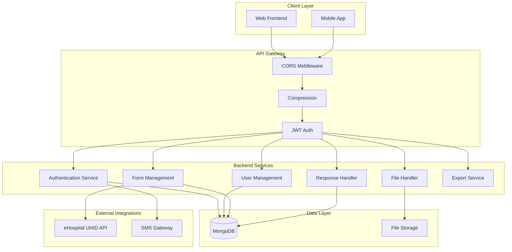

### 2.2 High-Level Features

| Feature Category | Description |
|-----------------|-------------|
| **User Authentication** | Password-based and OTP-based login, JWT tokens |
| **User Management** | CRUD operations, role assignment, account locking |
| **Form Builder** | Dynamic forms with sections, questions, validation |
| **Form Versioning** | Multiple versions of forms with history |
| **Response Collection** | Validated submissions with file support |
| **Data Export** | CSV and JSON export capabilities |
| **Analytics** | Response counts, submission tracking |
| **API Integrations** | External service connectivity |

---

## 3. User Roles & Permissions

### 3.1 User Types

| User Type | Description | Authentication Method |
|-----------|-------------|----------------------|
| `employee` | Organization staff | Username/Email/Employee ID + Password |
| `general` | External/public users | Mobile + OTP only |

### 3.2 Role Hierarchy

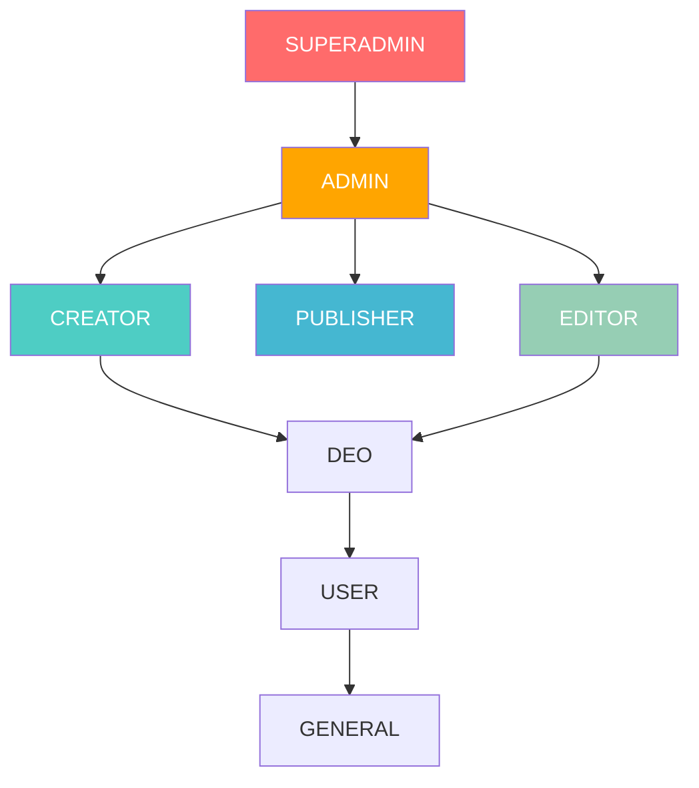

### 3.3 Role Definitions

| Role | Permissions |
|------|-------------|
| `superadmin` | Full system access, all administrative functions |
| `admin` | User management, form administration, system configuration |
| `creator` | Can create new forms |
| `editor` | Can edit existing forms (cannot create) |
| `publisher` | Can publish forms to make them active |
| `deo` | Data Entry Operator - can submit form responses |
| `user` | Basic authenticated user |
| `general` | Public user with minimal permissions |

### 3.4 Permission Matrix

| Action | Superadmin | Admin | Creator | Editor | Publisher | DEO | User |
|--------|:----------:|:-----:|:-------:|:------:|:---------:|:---:|:----:|
| Create Form | ✅ | ✅ | ✅ | ❌ | ❌ | ❌ | ❌ |
| Edit Form | ✅ | ✅ | ✅ | ✅ | ❌ | ❌ | ❌ |
| Delete Form | ✅ | ✅ | ❌ | ❌ | ❌ | ❌ | ❌ |
| Publish Form | ✅ | ✅ | ❌ | ✅ | ✅ | ❌ | ❌ |
| Submit Response | ✅ | ✅ | ✅ | ✅ | ✅ | ✅ | ✅ |
| View Responses | ✅ | ✅ | ✅ | ✅ | ✅ | ❌ | ❌ |
| Export Data | ✅ | ✅ | ✅ | ✅ | ✅ | ❌ | ❌ |
| Manage Users | ✅ | ✅ | ❌ | ❌ | ❌ | ❌ | ❌ |
| Lock/Unlock Users | ✅ | ✅ | ❌ | ❌ | ❌ | ❌ | ❌ |

---

## 4. Functional Requirements

### 4.1 Authentication Module

#### FR-AUTH-001: User Registration
**Description:** Allow new employee users to register in the system.

| Attribute | Specification |
|-----------|---------------|
| **Input** | username, email, employee_id, mobile, password, user_type, roles |
| **Validation** | Unique email, unique employee_id, password strength |
| **Output** | Success message with 201 status |
| **Security** | Password hashed with bcrypt, 90-day expiration set |

**Business Rules:**
- Email must be unique across all users
- Employee ID must be unique (for employee type)
- Password is hashed before storage
- Password expiration is set to 90 days from registration

---

#### FR-AUTH-002: Employee Login (Password)
**Description:** Authenticate employee users using identifier + password.

| Attribute | Specification |
|-----------|---------------|
| **Input** | identifier (email/username/employee_id) + password |
| **Validation** | Valid credentials, account not locked, password not expired |
| **Output** | JWT access token, HTTP-only cookie set |
| **Security** | Failed attempts tracked, account lock after 5 failures |

**Business Rules:**
- Login accepts email, username, OR employee_id as identifier
- Account is locked for 24 hours after 5 failed attempts
- Expired passwords require password change before login
- Last login timestamp is recorded on success

---

#### FR-AUTH-003: OTP Login
**Description:** Authenticate users (employee or general) via mobile OTP.

| Attribute | Specification |
|-----------|---------------|
| **Input** | mobile number + 6-digit OTP |
| **Validation** | Valid OTP, not expired (5 min TTL), account not locked |
| **Output** | JWT access token |
| **Security** | OTP resend limited to 5 attempts before lock |

**Business Rules:**
- OTP is valid for 5 minutes from generation
- General users can ONLY login via OTP (no password)
- Failed OTP attempts increment failed login counter

---

#### FR-AUTH-004: OTP Generation
**Description:** Generate and send OTP for mobile-based authentication.

| Attribute | Specification |
|-----------|---------------|
| **Input** | mobile number |
| **Validation** | Mobile exists in system |
| **Output** | Success message, OTP sent via SMS |
| **Security** | OTP is 6-digit random, stored securely |

**Business Rules:**
- User must exist with provided mobile number
- Previous OTP is overwritten on new generation
- OTP resend count is reset on new generation

---

#### FR-AUTH-005: Logout
**Description:** Invalidate user session by blocklisting JWT token.

| Attribute | Specification |
|-----------|---------------|
| **Input** | Valid JWT token (required) |
| **Process** | Add JTI to blocklist with expiration |
| **Output** | Success message, cookies cleared |

---

### 4.2 User Management Module

#### FR-USER-001: List All Users
**Description:** Retrieve all users in the system (admin only).

| Attribute | Specification |
|-----------|---------------|
| **Authorization** | `admin` or `superadmin` role required |
| **Output** | Array of user objects |
| **Included Fields** | All user fields except sensitive data |

---

#### FR-USER-002: Get User Details
**Description:** Retrieve details of a specific user.

| Attribute | Specification |
|-----------|---------------|
| **Authorization** | `admin` or `superadmin` role required |
| **Input** | user_id path parameter |
| **Output** | Single user object |

---

#### FR-USER-003: Create User
**Description:** Admin creation of new users.

| Attribute | Specification |
|-----------|---------------|
| **Authorization** | `admin` or `superadmin` role required |
| **Input** | User data including user_type, roles |
| **Validation** | Unique constraints on email/username/employee_id/mobile |
| **Output** | Created user object with 201 status |

---

#### FR-USER-004: Update User
**Description:** Modify existing user attributes.

| Attribute | Specification |
|-----------|---------------|
| **Authorization** | `admin` or `superadmin` role required |
| **Input** | user_id + fields to update |
| **Output** | Updated user object |

---

#### FR-USER-005: Delete User
**Description:** Remove user from system.

| Attribute | Specification |
|-----------|---------------|
| **Authorization** | `admin` or `superadmin` role required |
| **Input** | user_id path parameter |
| **Output** | Success message |

---

#### FR-USER-006: Lock User Account
**Description:** Manually lock a user account.

| Attribute | Specification |
|-----------|---------------|
| **Authorization** | `admin` or `superadmin` role required |
| **Effect** | User cannot login for 24 hours |
| **Output** | Success message with user ID |

---

#### FR-USER-007: Unlock User Account
**Description:** Remove lock from user account.

| Attribute | Specification |
|-----------|---------------|
| **Authorization** | `admin` or `superadmin` role required |
| **Effect** | Reset lock_until, failed_login_attempts, otp_resend_count |
| **Output** | Success message |

---

#### FR-USER-008: Change Password
**Description:** Allow authenticated user to change their password.

| Attribute | Specification |
|-----------|---------------|
| **Authorization** | Any authenticated user |
| **Input** | current_password + new_password |
| **Validation** | Current password must be correct |
| **Effect** | Password expiration reset to 90 days |

---

#### FR-USER-009: Reset Password
**Description:** Reset password via OTP or admin action.

| Attribute | Specification |
|-----------|---------------|
| **Input Option 1** | mobile + otp + new_password |
| **Input Option 2** | user_id + new_password (admin) |
| **Validation** | Valid OTP or admin authorization |

---

#### FR-USER-010: Extend Password Expiry
**Description:** Extend password expiration date for a user.

| Attribute | Specification |
|-----------|---------------|
| **Authorization** | `admin` or `superadmin` role required |
| **Input** | user_id + days (default: 90) |
| **Effect** | Password expiration extended |

---

### 4.3 Form Management Module

#### FR-FORM-001: Create Form
**Description:** Create a new form with sections, questions, and options.

| Attribute | Specification |
|-----------|---------------|
| **Authorization** | `creator` or `admin` role required |
| **Input** | title, description, slug, sections, ui layout |
| **Validation** | Unique slug required |
| **Output** | Created form ID |
| **Effect** | Creator automatically added as editor |

**Form Structure:**
```json
{
  "title": "Patient Registration",
  "description": "New patient intake form",
  "slug": "patient-registration",
  "ui": "flex",
  "versions": [
    {
      "version": "1.0",
      "sections": [
        {
          "title": "Personal Information",
          "questions": [...]
        }
      ]
    }
  ]
}
```

---

#### FR-FORM-002: List Forms
**Description:** Retrieve forms accessible to current user.

| Attribute | Specification |
|-----------|---------------|
| **Authorization** | Any authenticated user |
| **Filter** | Forms where user is creator OR editor |
| **Output** | Array of form objects |

---

#### FR-FORM-003: Get Form Details
**Description:** Retrieve complete form structure.

| Attribute | Specification |
|-----------|---------------|
| **Authorization** | User must have `view` permission on form |
| **Input** | form_id path parameter |
| **Output** | Complete form object with all sections/questions |

---

#### FR-FORM-004: Update Form
**Description:** Modify form attributes and structure.

| Attribute | Specification |
|-----------|---------------|
| **Authorization** | User must have `edit` permission on form |
| **Input** | form_id + fields to update |
| **Output** | Success message |

---

#### FR-FORM-005: Delete Form
**Description:** Remove form and all associated responses.

| Attribute | Specification |
|-----------|---------------|
| **Authorization** | `admin` or `superadmin` role required |
| **Effect** | Cascading delete of all responses and uploaded files |
| **Output** | Success message |

---

#### FR-FORM-006: Publish Form
**Description:** Change form status to published (makes it submittable).

| Attribute | Specification |
|-----------|---------------|
| **Authorization** | `editor` or `admin` role required |
| **Input** | form_id path parameter |
| **Effect** | Form status → "published" |

---

#### FR-FORM-007: Clone Form
**Description:** Create a copy of an existing form.

| Attribute | Specification |
|-----------|---------------|
| **Authorization** | Any authenticated user |
| **Input** | Source form_id |
| **Output** | New form_id |
| **Effect** | Title appended with "(Clone)", slug with "-copy", is_public=false |

---

#### FR-FORM-008: Share Form
**Description:** Add users to form permission lists.

| Attribute | Specification |
|-----------|---------------|
| **Authorization** | `admin` or `superadmin` role required |
| **Input** | editors[], viewers[], submitters[] |
| **Effect** | User IDs added to respective permission lists |

---

#### FR-FORM-009: Archive Form
**Description:** Move form to archived status.

| Attribute | Specification |
|-----------|---------------|
| **Authorization** | `admin` or `superadmin` role required |
| **Effect** | Form status → "archived" |

---

#### FR-FORM-010: Restore Form
**Description:** Restore archived form to draft status.

| Attribute | Specification |
|-----------|---------------|
| **Authorization** | `admin` or `superadmin` role required |
| **Prerequisite** | Form must be in "archived" status |
| **Effect** | Form status → "draft" |

---

#### FR-FORM-011: Toggle Public Access
**Description:** Toggle whether form allows anonymous submissions.

| Attribute | Specification |
|-----------|---------------|
| **Authorization** | `admin` or `superadmin` role required |
| **Effect** | is_public toggled |
| **Output** | Current is_public value |

---

#### FR-FORM-012: Check Slug Availability
**Description:** Verify if a slug is available for use.

| Attribute | Specification |
|-----------|---------------|
| **Input** | slug query parameter |
| **Output** | { available: boolean } |

---

#### FR-FORM-013: Set Form Expiration
**Description:** Schedule automatic form expiration.

| Attribute | Specification |
|-----------|---------------|
| **Authorization** | `admin` or `superadmin` role required |
| **Input** | expires_at timestamp |
| **Effect** | Form auto-expires at specified time |

---

#### FR-FORM-014: List Expired Forms
**Description:** Retrieve all forms past their expiration date.

| Attribute | Specification |
|-----------|---------------|
| **Authorization** | `admin` or `superadmin` role required |
| **Output** | Array of expired form objects |

---

### 4.4 Form Response Module

#### FR-RESP-001: Submit Response
**Description:** Submit data to a form (authenticated).

| Attribute | Specification |
|-----------|---------------|
| **Authorization** | User must have `submit` permission on form |
| **Input** | form_id + response data (JSON or multipart) |
| **Validation** | Field-level validation per question rules |
| **Output** | response_id with 201 status |

**Validation Rules Applied:**
- Required field validation
- Field type validation (text, number, checkbox, radio, etc.)
- Repeatable section/question min/max limits
- Custom validation rules (min_length, max_length, selections)
- Visibility condition evaluation
- File upload validation

---

#### FR-RESP-002: Public Submit Response
**Description:** Anonymous submission to public forms.

| Attribute | Specification |
|-----------|---------------|
| **Authorization** | None required |
| **Prerequisite** | Form must have is_public=true |
| **Input** | form_id + response data |
| **Effect** | submitted_by = "anonymous" |

---

#### FR-RESP-003: List Responses
**Description:** Retrieve all responses for a form.

| Attribute | Specification |
|-----------|---------------|
| **Authorization** | User must have `view` permission on form |
| **Input** | form_id path parameter |
| **Output** | Array of response objects |

---

#### FR-RESP-004: Get Single Response
**Description:** Retrieve specific response details.

| Attribute | Specification |
|-----------|---------------|
| **Authorization** | User must have `view` permission on form |
| **Input** | form_id + response_id |
| **Output** | Single response object |

---

#### FR-RESP-005: Update Response
**Description:** Modify submitted response data.

| Attribute | Specification |
|-----------|---------------|
| **Authorization** | Original submitter only |
| **Input** | form_id + response_id + updated data |
| **Effect** | updated_by and updated_at set |

---

#### FR-RESP-006: Delete Response
**Description:** Remove a response from a form.

| Attribute | Specification |
|-----------|---------------|
| **Authorization** | User must have `edit` permission on form |
| **Input** | form_id + response_id |
| **Output** | Success message |

---

#### FR-RESP-007: Paginated Responses
**Description:** Retrieve responses with pagination.

| Attribute | Specification |
|-----------|---------------|
| **Authorization** | User must have `view` permission on form |
| **Input** | form_id, page (default 1), limit (default 10) |
| **Output** | { total, page, responses[] } |

---

#### FR-RESP-008: Archive Response
**Description:** Mark a response as archived.

| Attribute | Specification |
|-----------|---------------|
| **Authorization** | Original submitter OR user with `edit` permission |
| **Effect** | Response status → "archived" |

---

#### FR-RESP-009: Search Responses
**Description:** Advanced search with filtering, sorting, and cursor pagination.

| Attribute | Specification |
|-----------|---------------|
| **Authorization** | Any authenticated user |
| **Features** | Field filters, date range, logical operators, saved searches |
| **Sorting** | Configurable sort field and order |
| **Pagination** | Cursor-based with next/prev cursors |

**Search Capabilities:**
- Filter by question values with operators (eq, gt, lt, gte, lte)
- Fuzzy string matching (icontains)
- Date range filtering
- Nested logical operators ($or, $and, $not)
- Saved search integration
- Include/exclude specific sections/questions

**Example Search Payload:**
```json
{
  "data": {
    "question_uuid": {
      "value": "John",
      "type": "string",
      "fuzzy": true
    }
  },
  "date_range": {
    "start": "2026-01-01T00:00:00Z",
    "end": "2026-01-31T23:59:59Z"
  },
  "sort_by": "submitted_at",
  "sort_order": "desc",
  "limit": 20,
  "include": {
    "sections": ["section_uuid"],
    "questions": ["question_uuid"]
  }
}
```

---

#### FR-RESP-010: Delete All Responses
**Description:** Bulk delete all responses for a form.

| Attribute | Specification |
|-----------|---------------|
| **Authorization** | `admin` or `superadmin` role required |
| **Input** | form_id path parameter |
| **Output** | Deleted count |

---

#### FR-RESP-011: Count Responses
**Description:** Get total response count for a form.

| Attribute | Specification |
|-----------|---------------|
| **Authorization** | Any authenticated user |
| **Input** | form_id path parameter |
| **Output** | { form_id, response_count } |

---

#### FR-RESP-012: Get Last Response
**Description:** Retrieve most recent response for a form.

| Attribute | Specification |
|-----------|---------------|
| **Authorization** | Any authenticated user |
| **Input** | form_id path parameter |
| **Output** | Most recent response object |

---

#### FR-RESP-013: Check Duplicate Submission
**Description:** Detect if identical submission already exists.

| Attribute | Specification |
|-----------|---------------|
| **Authorization** | Any authenticated user |
| **Input** | form_id + data to check |
| **Output** | { duplicate: boolean } |

---

### 4.5 Export Module

#### FR-EXPORT-001: Export Responses to CSV
**Description:** Download form responses as CSV file.

| Attribute | Specification |
|-----------|---------------|
| **Authorization** | User must have `view` permission on form |
| **Output** | CSV file with response_id, submitted_by, submitted_at, data |
| **Headers** | Content-Disposition: attachment |

---

#### FR-EXPORT-002: Export Form with Responses to JSON
**Description:** Download form structure and all responses as JSON.

| Attribute | Specification |
|-----------|---------------|
| **Authorization** | User must have `view` permission on form |
| **Output** | JSON with form_metadata + responses[] |
| **MIME Type** | application/json |

---

### 4.6 File Management Module

#### FR-FILE-001: Upload File (within response)
**Description:** Upload files as part of form response submission.

| Attribute | Specification |
|-----------|---------------|
| **Authorization** | User must have `submit` permission on form |
| **Input** | Multipart form data with files |
| **Storage Path** | uploads/{form_id}/{question_id}/{filename} |
| **Output** | File info object (filename, filepath, size, mimetype) |

---

#### FR-FILE-002: Retrieve Uploaded File
**Description:** Download previously uploaded file.

| Attribute | Specification |
|-----------|---------------|
| **Authorization** | View permission OR public form |
| **Validation** | Question must be of type `file_upload` |
| **Input** | form_id, question_id, filename |
| **Output** | File stream |

---

### 4.7 Analytics Module

#### FR-ANALYTICS-001: Get Form Analytics
**Description:** Retrieve submission statistics for a form.

| Attribute | Specification |
|-----------|---------------|
| **Authorization** | User must have `view` permission on form |
| **Output** | { total_responses, latest_submission } |

---

#### FR-ANALYTICS-002: Form Submission History
**Description:** Retrieve submission history by primary field value.

| Attribute | Specification |
|-----------|---------------|
| **Authorization** | Any authenticated user |
| **Input** | form_id, question_id, primary_value |
| **Output** | Array of { _id, submitted_at } |
| **Use Case** | Track all submissions by a specific identifier (e.g., patient ID) |

---

### 4.8 API Integration Module

#### FR-API-001: UHID Lookup
**Description:** Query external eHospital system for patient UHID data.

| Attribute | Specification |
|-----------|---------------|
| **Trigger** | Question with field_api_call="uhid" |
| **Input** | UHID value |
| **Output** | Patient data from external system |

---

#### FR-API-002: OTP SMS Integration
**Description:** Send OTP via SMS gateway for field verification.

| Attribute | Specification |
|-----------|---------------|
| **Trigger** | Question with field_api_call="otp" |
| **Input** | Mobile number |
| **Output** | OTP sent confirmation + OTP value |

---

#### FR-API-003: Cross-Form Data Lookup
**Description:** Query responses from another form.

| Attribute | Specification |
|-----------|---------------|
| **Trigger** | Question with field_api_call="form" |
| **Input** | Search payload with target form_id |
| **Output** | Matching responses from target form |

---

#### FR-API-004: Custom Script Execution
**Description:** Execute custom server-side script for field.

| Attribute | Specification |
|-----------|---------------|
| **Trigger** | Question with field_api_call="custom" |
| **Input** | Depends on custom_script definition |
| **Output** | Depends on script |

---

## 5. Non-Functional Requirements

### 5.1 Performance Requirements

| Requirement | Specification |
|-------------|---------------|
| **NFR-PERF-001** | API response time < 500ms for 95% of requests |
| **NFR-PERF-002** | Support 100+ concurrent users |
| **NFR-PERF-003** | Form response search < 2 seconds for 10,000 responses |
| **NFR-PERF-004** | File upload support up to 10MB per file |

### 5.2 Security Requirements

| Requirement | Specification |
|-------------|---------------|
| **NFR-SEC-001** | All passwords hashed using bcrypt |
| **NFR-SEC-002** | JWT tokens expire after configured duration |
| **NFR-SEC-003** | Token blocklist for logout invalidation |
| **NFR-SEC-004** | Account lockout after 5 failed attempts |
| **NFR-SEC-005** | Password expiration after 90 days |
| **NFR-SEC-006** | CORS enabled for cross-origin requests |
| **NFR-SEC-007** | Input validation on all user inputs |

### 5.3 Reliability Requirements

| Requirement | Specification |
|-------------|---------------|
| **NFR-REL-001** | Rotating log files with 5 backup files, 10KB each |
| **NFR-REL-002** | MongoDB connection health check on startup |
| **NFR-REL-003** | Graceful error handling with appropriate HTTP status codes |

### 5.4 Scalability Requirements

| Requirement | Specification |
|-------------|---------------|
| **NFR-SCALE-001** | MongoDB indexes on frequently queried fields |
| **NFR-SCALE-002** | Cursor-based pagination for large result sets |
| **NFR-SCALE-003** | Response compression via Flask-Compress |

---

## 6. Data Models

### 6.1 User Model

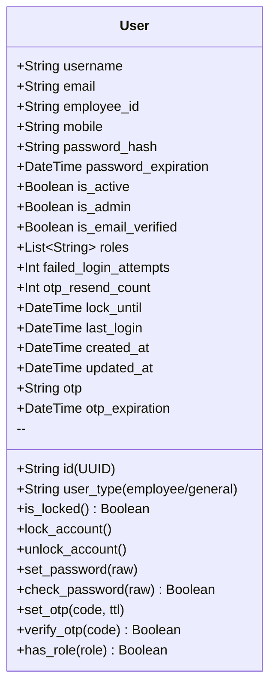

**Indexes:**
- `username` (unique, sparse)
- `email` (unique, sparse)
- `employee_id` (unique, sparse)
- `mobile` (unique, sparse)

---

### 6.2 Form Model

```mermaid
classDiagram
    class Form {
        +UUID id
        +String title
        +String description
        +String slug (unique)
        +String created_by
        +String status (draft/published/archived)
        +String ui (flex/grid-cols-2/tabbed/custom)
        +String submit_scripts
        +DateTime created_at
        +DateTime updated_at
        +Boolean is_public
        +List~FormVersion~ versions
        +List~String~ tags
        +List~ResponseTemplate~ response_templates
        +List~String~ editors
        +List~String~ viewers
        +List~String~ submitters
    }
    
    class FormVersion {
        +String version
        +String created_by
        +DateTime created_at
        +List~Section~ sections
    }
    
    class Section {
        +UUID id
        +String title
        +String description
        +Int order
        +String visibility_condition
        +String validation_rules
        +Boolean is_disabled
        +String ui
        +Boolean is_repeatable_section
        +Int repeat_min
        +Int repeat_max
        +List~Question~ questions
        +Dict meta_data
    }
    
    class Question {
        +UUID id
        +String label
        +String field_type
        +Boolean is_required
        +String help_text
        +String default_value
        +Int order
        +String visibility_condition
        +String validation_rules
        +Boolean is_repeatable_question
        +Int repeat_min
        +Int repeat_max
        +String onChange
        +String calculated_value
        +Boolean is_disabled
        +Boolean visible_header
        +String visible_name
        +List~Option~ options
        +String field_api_call
        +String custom_script
        +Dict meta_data
    }
    
    class Option {
        +UUID id
        +String description
        +Boolean is_default
        +Boolean is_disabled
        +String option_label
        +String option_value
        +Int order
        +String followup_visibility_condition
    }
    
    Form "1" --> "*" FormVersion
    FormVersion "1" --> "*" Section
    Section "1" --> "*" Question
    Question "1" --> "*" Option
```

---

### 6.3 Form Response Model

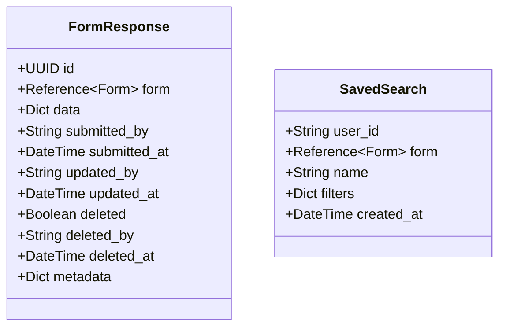

**FormResponse Indexes:**
- `form`
- `submitted_by`
- `submitted_at`
- `(form, submitted_at)` compound
- `(form, submitted_by)` compound
- `deleted`

---

### 6.4 Field Types

| Field Type | Description | Validation |
|------------|-------------|------------|
| `input` | Single-line text input | String type |
| `textarea` | Multi-line text input | String type |
| `select` | Dropdown selection | Must match option value |
| `checkbox` | Multiple selection | Array of values |
| `radio` | Single selection | Must match option value |
| `boolean` | Yes/No toggle | Boolean type |
| `rating` | Star rating | Numeric type |
| `date` | Date picker | Date format |
| `file_upload` | File attachment | File info object |
| `api_search` | External API lookup | Depends on API type |
| `calculated` | Computed field | Expression-based |

---

### 6.5 API Call Types

| API Type | Description | Parameters |
|----------|-------------|------------|
| `uhid` | eHospital patient lookup | UHID value |
| `employee_id` | Employee data lookup | Employee ID |
| `form` | Cross-form response search | Search payload |
| `otp` | SMS OTP verification | Mobile number |
| `custom` | Custom script execution | Script-defined |

---

## 7. API Endpoints Reference

### 7.1 Authentication Endpoints

| Method | Endpoint | Description | Auth Required |
|--------|----------|-------------|:-------------:|
| POST | `/api/v1/auth/register` | Register new user | ❌ |
| POST | `/api/v1/auth/login` | Login (password/OTP) | ❌ |
| POST | `/api/v1/auth/generate-otp` | Generate OTP | ❌ |
| POST | `/api/v1/auth/logout` | Logout (invalidate token) | ✅ |

### 7.2 User Management Endpoints

| Method | Endpoint | Description | Auth Required | Roles |
|--------|----------|-------------|:-------------:|-------|
| GET | `/api/v1/user/status` | Get current user | ✅ | Any |
| POST | `/api/v1/user/change-password` | Change password | ✅ | Any |
| POST | `/api/v1/user/reset-password` | Reset password | ❌/✅ | - |
| POST | `/api/v1/user/unlock` | Unlock account | ✅ | Admin |
| GET | `/api/v1/user/users` | List all users | ✅ | Admin |
| GET | `/api/v1/user/users/{id}` | Get user details | ✅ | Admin |
| POST | `/api/v1/user/users` | Create user | ✅ | Admin |
| PUT | `/api/v1/user/users/{id}` | Update user | ✅ | Admin |
| DELETE | `/api/v1/user/users/{id}` | Delete user | ✅ | Admin |
| POST | `/api/v1/user/users/{id}/lock` | Lock user | ✅ | Admin |
| POST | `/api/v1/user/users/{id}/unlock` | Unlock user | ✅ | Admin |
| POST | `/api/v1/user/users/{id}/reset-otp-count` | Reset OTP count | ✅ | Admin |
| POST | `/api/v1/user/security/extend-password-expiry` | Extend password | ✅ | Admin |
| GET | `/api/v1/user/security/lock-status/{id}` | Check lock status | ✅ | Admin |
| POST | `/api/v1/user/security/resend-otp` | Resend OTP | ❌ | - |

### 7.3 Form Management Endpoints

| Method | Endpoint | Description | Auth Required | Roles |
|--------|----------|-------------|:-------------:|-------|
| POST | `/api/v1/form/` | Create form | ✅ | Creator/Admin |
| GET | `/api/v1/form/` | List forms | ✅ | Any |
| GET | `/api/v1/form/{id}` | Get form | ✅ | View permission |
| PUT | `/api/v1/form/{id}` | Update form | ✅ | Edit permission |
| DELETE | `/api/v1/form/{id}` | Delete form | ✅ | Admin |
| PATCH | `/api/v1/form/{id}/publish` | Publish form | ✅ | Editor/Admin |
| POST | `/api/v1/form/{id}/clone` | Clone form | ✅ | Any |
| POST | `/api/v1/form/{id}/share` | Share form | ✅ | Admin |
| PATCH | `/api/v1/form/{id}/archive` | Archive form | ✅ | Admin |
| PATCH | `/api/v1/form/{id}/restore` | Restore form | ✅ | Admin |
| PATCH | `/api/v1/form/{id}/toggle-public` | Toggle public | ✅ | Admin |
| GET | `/api/v1/form/slug-available` | Check slug | ✅ | Any |
| PATCH | `/api/v1/form/{id}/expire` | Set expiration | ✅ | Admin |
| GET | `/api/v1/form/expired` | List expired | ✅ | Admin |

### 7.4 Form Response Endpoints

| Method | Endpoint | Description | Auth Required |
|--------|----------|-------------|:-------------:|
| POST | `/api/v1/form/{id}/responses` | Submit response | ✅ |
| POST | `/api/v1/form/{id}/public-submit` | Anonymous submit | ❌ |
| GET | `/api/v1/form/{id}/responses` | List responses | ✅ |
| GET | `/api/v1/form/{id}/responses/{rid}` | Get response | ✅ |
| PUT | `/api/v1/form/{id}/responses/{rid}` | Update response | ✅ |
| DELETE | `/api/v1/form/{id}/responses/{rid}` | Delete response | ✅ |
| DELETE | `/api/v1/form/{id}/responses` | Delete all | ✅ |
| GET | `/api/v1/form/{id}/responses/paginated` | Paginated list | ✅ |
| PATCH | `/api/v1/form/{id}/responses/{rid}/archive` | Archive response | ✅ |
| POST | `/api/v1/form/{id}/responses/search` | Search responses | ✅ |
| GET | `/api/v1/form/{id}/responses/count` | Count responses | ✅ |
| GET | `/api/v1/form/{id}/responses/last` | Last response | ✅ |
| POST | `/api/v1/form/{id}/check-duplicate` | Check duplicate | ✅ |

### 7.5 Export & Analytics Endpoints

| Method | Endpoint | Description | Auth Required |
|--------|----------|-------------|:-------------:|
| GET | `/api/v1/form/{id}/export/csv` | Export CSV | ✅ |
| GET | `/api/v1/form/{id}/export/json` | Export JSON | ✅ |
| GET | `/api/v1/form/{id}/analytics` | Form analytics | ✅ |
| GET | `/api/v1/form/{id}/history` | Submission history | ✅ |

### 7.6 File & API Endpoints

| Method | Endpoint | Description | Auth Required |
|--------|----------|-------------|:-------------:|
| GET | `/api/v1/form/{id}/files/{qid}/{filename}` | Get file | ❌/✅ |
| GET | `/api/v1/form/{id}/section/{sid}/question/{qid}/api` | API call | ✅ |

---

## 8. Security Requirements

### 8.1 Authentication Security

| Requirement | Implementation |
|-------------|----------------|
| Password Storage | bcrypt hashing with salt |
| Token Type | JWT with claims |
| Token Storage | HTTP-only cookies + Authorization header |
| Token Invalidation | Blocklist with JTI tracking |
| Session Management | Token expiration + blocklist |

### 8.2 Account Security

| Feature | Configuration |
|---------|---------------|
| Max Failed Attempts | 5 attempts before lock |
| Max OTP Resends | 5 resends before lock |
| Lock Duration | 24 hours |
| Password Expiration | 90 days |
| OTP Validity | 5 minutes |

### 8.3 Input Validation

- All user inputs validated at API boundary
- JSON schema validation for form submissions
- File type and size validation for uploads
- SQL injection prevention (MongoDB NoSQL)
- XSS prevention through proper encoding

### 8.4 Authorization

- Role-based access control (RBAC)
- Form-level permission (editors, viewers, submitters)
- Decorator-based route protection
- JWT claims for role verification

---

## 9. Integration Requirements

### 9.1 External API: eHospital UHID

| Attribute | Specification |
|-----------|---------------|
| Purpose | Patient data lookup by UHID |
| Protocol | HTTP REST |
| Authentication | Configured in environment |
| Response | Patient demographic data |

### 9.2 External API: SMS Gateway

| Attribute | Specification |
|-----------|---------------|
| Purpose | OTP delivery to mobile numbers |
| Protocol | HTTP REST |
| Authentication | API key in environment |
| Response | Delivery status |

### 9.3 Database: MongoDB

| Attribute | Specification |
|-----------|---------------|
| ODM | MongoEngine |
| Connection | Connection string with auth |
| Collections | users, forms, form_responses, token_blocklist, saved_searches |

---

## Appendix A: Environment Configuration

| Variable | Description | Example |
|----------|-------------|---------|
| `MONGODB_HOST` | MongoDB host | localhost |
| `MONGODB_PORT` | MongoDB port | 27017 |
| `MONGODB_DB` | Database name | form_db |
| `MONGODB_USERNAME` | Database user | - |
| `MONGODB_PASSWORD` | Database password | - |
| `JWT_SECRET_KEY` | JWT signing key | - |
| `UPLOAD_FOLDER` | File upload path | uploads |
| `SMS_API_KEY` | SMS gateway key | - |
| `SMS_API_URL` | SMS gateway URL | - |
| `EHOSPITAL_API_URL` | eHospital API URL | - |

---

## Appendix B: HTTP Status Codes

| Code | Meaning | Usage |
|------|---------|-------|
| 200 | OK | Successful GET/PUT/PATCH |
| 201 | Created | Successful POST (create) |
| 400 | Bad Request | Invalid input/validation error |
| 401 | Unauthorized | Missing/invalid authentication |
| 403 | Forbidden | Insufficient permissions |
| 404 | Not Found | Resource doesn't exist |
| 409 | Conflict | Duplicate resource (email, slug) |
| 422 | Unprocessable Entity | Validation errors in submission |
| 500 | Internal Server Error | Server-side error |

---

## Appendix C: Form Builder Specifications

This appendix provides comprehensive documentation of all form building features, field types, and corner cases.

### C.1 Form Structure Hierarchy

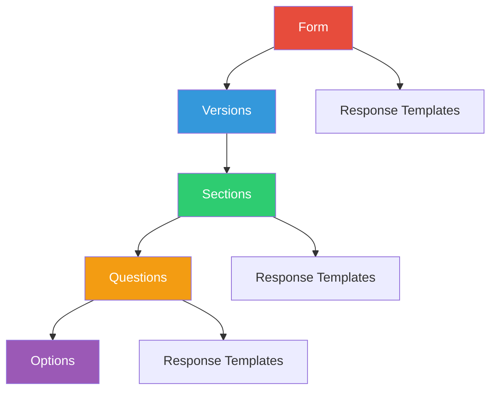

---

### C.2 Form-Level Configuration

| Property | Type | Required | Description |
|----------|------|:--------:|-------------|
| `id` | UUID | ✅ | Auto-generated unique identifier |
| `title` | String | ✅ | Form display title (max 255 chars) |
| `description` | String | ❌ | Detailed form description |
| `slug` | String | ✅ | URL-friendly identifier (unique) |
| `status` | Enum | ✅ | `draft` \| `published` \| `archived` |
| `ui` | Enum | ✅ | Layout: `flex` \| `grid-cols-2` \| `tabbed` \| `custom` |
| `is_public` | Boolean | ✅ | Allow anonymous submissions |
| `created_by` | String | ✅ | Creator user ID |
| `tags` | Array | ❌ | Categorization tags |
| `submit_scripts` | String | ❌ | Custom submission scripts |
| `editors` | Array | ❌ | User IDs with edit permission |
| `viewers` | Array | ❌ | User IDs with view permission |
| `submitters` | Array | ❌ | User IDs with submit permission |
| `expires_at` | DateTime | ❌ | Auto-expiration timestamp |

**Form Status Workflow:**
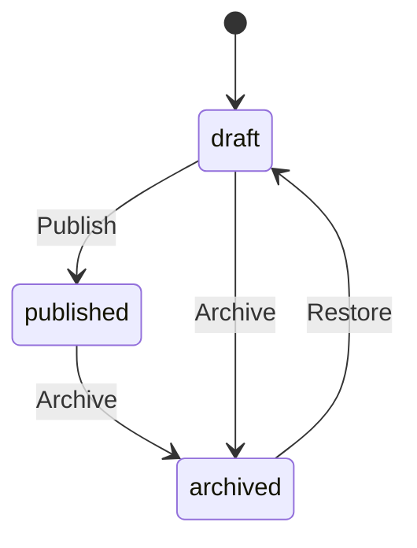

---

### C.3 Form Versioning

Each form maintains a history of versions for audit and rollback purposes.

| Property | Type | Required | Description |
|----------|------|:--------:|-------------|
| `version` | String | ✅ | Semantic version (e.g., "1.0", "2.1") |
| `created_by` | String | ❌ | User who created version |
| `created_at` | DateTime | ✅ | Version creation timestamp |
| `sections` | Array | ✅ | Section definitions |

**Corner Cases:**
- ⚠️ Latest version (`versions[-1]`) is always used for new submissions
- ⚠️ Existing responses reference the version at submission time
- ⚠️ Deleting versions should be restricted to prevent orphan responses

---

### C.4 Section Configuration

| Property | Type | Required | Description |
|----------|------|:--------:|-------------|
| `id` | UUID | ✅ | Auto-generated unique identifier |
| `title` | String | ✅ | Section heading |
| `description` | String | ❌ | Section instructions/help text |
| `order` | Integer | ❌ | Display order (lower = first) |
| `ui` | Enum | ✅ | Layout: `flex` \| `grid-cols-2` \| `tabbed` \| `custom` |
| `is_disabled` | Boolean | ❌ | Prevent section display |
| `visibility_condition` | String | ❌ | JavaScript-like expression |
| `validation_rules` | String | ❌ | JSON validation configuration |
| `is_repeatable_section` | Boolean | ❌ | Allow multiple instances |
| `repeat_min` | Integer | ❌ | Minimum repetitions (if repeatable) |
| `repeat_max` | Integer | ❌ | Maximum repetitions (if repeatable) |
| `meta_data` | Dict | ❌ | Custom metadata |

#### C.4.1 Section UI Layouts

| Layout | Description | Use Case |
|--------|-------------|----------|
| `flex` | Vertical stack, full width | Default, simple forms |
| `grid-cols-2` | Two-column grid | Address forms, paired fields |
| `tabbed` | Tab navigation | Multi-step wizards |
| `custom` | Custom CSS/JavaScript | Complex layouts |

#### C.4.2 Repeatable Sections

Allows users to add multiple instances of a section (e.g., "Add Another Family Member").

**Example Configuration:**
```json
{
  "title": "Family Members",
  "is_repeatable_section": true,
  "repeat_min": 1,
  "repeat_max": 10,
  "questions": [...]
}
```

**Response Data Structure (Repeatable):**
```json
{
  "section_uuid": [
    { "question_uuid": "value1", "question_uuid2": "value2" },
    { "question_uuid": "value3", "question_uuid2": "value4" }
  ]
}
```

**Corner Cases:**
- ⚠️ `repeat_min: 0` allows zero instances (optional section)
- ⚠️ `repeat_max: null` allows unlimited instances
- ⚠️ Validation applies to EACH instance independently
- ⚠️ File uploads in repeatable sections create separate files per instance

---

### C.5 Question/Field Types

#### C.5.1 Complete Field Type Reference

| Field Type | Description | Validation | Options Required |
|------------|-------------|------------|:----------------:|
| `input` | Single-line text | String | ❌ |
| `textarea` | Multi-line text | String | ❌ |
| `select` | Dropdown picker | Must match option | ✅ |
| `radio` | Single choice | Must match option | ✅ |
| `checkbox` | Multiple choice | Array of values | ✅ |
| `boolean` | Yes/No toggle | Boolean | ❌ |
| `date` | Date picker | ISO date format | ❌ |
| `rating` | Star rating | Integer 1-5 | ❌ |
| `file_upload` | File attachment | File object | ❌ |
| `api_search` | External API lookup | Depends on API | ❌ |
| `calculated` | Computed value | Expression result | ❌ |
| `file` | Legacy file type | File object | ❌ |

#### C.5.2 Field Configuration Properties

| Property | Type | Required | Description |
|----------|------|:--------:|-------------|
| `id` | UUID | ✅ | Auto-generated unique identifier |
| `label` | String | ✅ | Question text/prompt |
| `field_type` | Enum | ✅ | One of the field types above |
| `is_required` | Boolean | ❌ | Mandatory field |
| `help_text` | String | ❌ | Hint text below field |
| `default_value` | String | ❌ | Pre-filled value |
| `order` | Integer | ❌ | Display order |
| `is_disabled` | Boolean | ❌ | Read-only field |
| `visibility_condition` | String | ❌ | Show/hide logic |
| `validation_rules` | String | ❌ | JSON validation config |
| `is_repeatable_question` | Boolean | ❌ | Allow multiple answers |
| `repeat_min` | Integer | ❌ | Min answers (if repeatable) |
| `repeat_max` | Integer | ❌ | Max answers (if repeatable) |
| `onChange` | String | ❌ | Event handler script |
| `calculated_value` | String | ❌ | Formula for calculated fields |
| `visible_header` | Boolean | ❌ | Show in response table header |
| `visible_name` | String | ❌ | Display name for exports |
| `options` | Array | ❌ | Choices for select/radio/checkbox |
| `field_api_call` | Enum | ❌ | API integration type |
| `custom_script` | String | ❌ | Custom JavaScript |
| `meta_data` | Dict | ❌ | Custom metadata |

---

### C.6 Options Configuration (for select/radio/checkbox)

| Property | Type | Required | Description |
|----------|------|:--------:|-------------|
| `id` | UUID | ✅ | Auto-generated unique identifier |
| `option_label` | String | ✅ | Display text |
| `option_value` | String | ✅ | Stored value |
| `description` | String | ❌ | Additional context |
| `is_default` | Boolean | ❌ | Pre-selected option |
| `is_disabled` | Boolean | ❌ | Greyed out, not selectable |
| `order` | Integer | ❌ | Display order |
| `followup_visibility_condition` | String | ❌ | Show follow-up questions |

**Example Options Array:**
```json
{
  "field_type": "radio",
  "options": [
    { "option_label": "Yes", "option_value": "yes", "order": 1 },
    { "option_label": "No", "option_value": "no", "order": 2 },
    { "option_label": "Not Sure", "option_value": "unsure", "order": 3, "is_disabled": true }
  ]
}
```

---

### C.7 Validation Rules

Validation rules are stored as JSON string and applied during submission.

#### C.7.1 Supported Validation Rules

| Rule | Applies To | Description |
|------|------------|-------------|
| `min_length` | text, textarea | Minimum character count |
| `max_length` | text, textarea | Maximum character count |
| `min_selections` | checkbox | Minimum choices required |
| `max_selections` | checkbox | Maximum choices allowed |
| `pattern` | text | Regex pattern match |
| `min` | number, rating | Minimum numeric value |
| `max` | number, rating | Maximum numeric value |

**Example Validation Rules:**
```json
{
  "min_length": 10,
  "max_length": 500,
  "pattern": "^[A-Za-z ]+$"
}
```

#### C.7.2 Checkbox Validation Example
```json
{
  "validation_rules": "{\"min_selections\": 2, \"max_selections\": 5}"
}
```

---

### C.8 Visibility Conditions

Visibility conditions control when fields/sections appear based on other answers.

#### C.8.1 Condition Syntax

Conditions are Python-like expressions evaluated at runtime:

```python
# Simple equality
'question_uuid' == 'yes'

# Multiple conditions
'q1' == 'yes' and 'q2' != 'no'

# Numeric comparison
int('q_age') >= 18

# Contains check
'option1' in 'q_checkbox'
```

#### C.8.2 Evaluation Context

The evaluation context contains all submitted answers keyed by question UUID:

```python
context = {
    "uuid-1": "John",
    "uuid-2": "25",
    "uuid-3": "yes"
}
```

#### C.8.3 Follow-up Option Visibility

Options can trigger visibility of follow-up questions:

```json
{
  "option_label": "Other",
  "option_value": "other",
  "followup_visibility_condition": "'other' in answers"
}
```

---

### C.9 API Integration Fields

Fields can integrate with external APIs via `field_api_call`.

| API Type | Description | Input | Output |
|----------|-------------|-------|--------|
| `uhid` | Hospital patient lookup | UHID number | Patient data object |
| `employee_id` | Employee data lookup | Employee ID | Employee data object |
| `otp` | SMS OTP verification | Mobile number | OTP code |
| `form` | Cross-form data search | Search payload | Form responses |
| `custom` | Custom script execution | Script-defined | Script-defined |

**Endpoint Pattern:**
```
GET /api/v1/form/{form_id}/section/{section_id}/question/{question_id}/api?value={input}
```

---

### C.10 File Upload Configuration

#### C.10.1 Allowed File Types
```python
ALLOWED_EXTENSIONS = {
    'txt', 'pdf', 'png', 'jpg', 'jpeg', 'gif', 
    'doc', 'docx', 'xls', 'xlsx', 'ppt', 'pptx', 'csv'
}
```

#### C.10.2 File Size Limit
- **Maximum:** 10 MB per file

#### C.10.3 Storage Structure
```
uploads/
└── {form_id}/
    └── {question_id}/
        └── {uuid}_{original_filename}
```

#### C.10.4 File Response Object
```json
{
  "original_filename": "document.pdf",
  "stored_filename": "a1b2c3d4_document.pdf",
  "filepath": "uploads/form-uuid/question-uuid/a1b2c3d4_document.pdf",
  "mimetype": "application/pdf",
  "size": 1048576,
  "upload_date": "2026-01-08T10:30:00Z"
}
```

---

### C.11 Calculated Fields

Calculated fields compute values based on other field answers.

**Configuration:**
```json
{
  "field_type": "calculated",
  "calculated_value": "int('q_price') * int('q_quantity')"
}
```

**Use Cases:**
- Total calculations
- Age from date of birth
- BMI from height/weight
- Conditional scoring

---

### C.12 Response Templates

Templates define structured output formats for different contexts.

| Property | Type | Description |
|----------|------|-------------|
| `name` | String | Template identifier |
| `description` | String | Template purpose |
| `structure` | String | JSON schema or HTML template |
| `tags` | Array | Categorization |
| `meta_data` | Dict | Custom properties |

Templates can be defined at Form, Section, or Question level.

---

### C.13 Corner Cases & Edge Conditions

#### C.13.1 Form Creation Corner Cases

| Scenario | Expected Behavior |
|----------|-------------------|
| Duplicate slug | 409 Conflict error |
| Empty title | 400 Bad Request |
| No sections | Form created but not submittable |
| Circular visibility conditions | Stack overflow on evaluation |
| Invalid field_type | 400 Bad Request with validation error |

#### C.13.2 Section Corner Cases

| Scenario | Expected Behavior |
|----------|-------------------|
| `repeat_min > repeat_max` | Validation error on submission |
| All questions disabled | Section skipped in rendering |
| Nested repeatable sections | Not supported (single level only) |
| Section with 0 questions | Valid but renders empty |

#### C.13.3 Question Corner Cases

| Scenario | Expected Behavior |
|----------|-------------------|
| Required field with visibility=false | Skipped in validation |
| Radio with no options | Renders empty, cannot submit |
| Checkbox with `is_required=true` | At least one selection needed |
| File upload without file | Null/empty if not required |
| Calculated field with invalid formula | Returns null, logs error |
| Default value for required field | Pre-filled, passes validation |

#### C.13.4 Submission Corner Cases

| Scenario | Expected Behavior |
|----------|-------------------|
| Submit to draft form | 403 Forbidden (form not published) |
| Submit to archived form | 403 Forbidden |
| Submit to expired form | 403 Forbidden |
| Partial data submission | Only required fields validated |
| Extra fields in payload | Ignored, not stored |
| Malformed JSON | 400 Bad Request |
| File > 10MB | 400 Bad Request |
| Disallowed file type | 400 Bad Request |

#### C.13.5 Validation Corner Cases

| Scenario | Expected Behavior |
|----------|-------------------|
| `min_length` on empty optional field | Pass (empty is allowed) |
| `max_selections` exceeded | 422 with error details |
| Regex pattern mismatch | 422 with error details |
| Invalid date format | 422 with error details |
| Radio value not in options | 422 with error details |

#### C.13.6 Permission Corner Cases

| Scenario | Expected Behavior |
|----------|-------------------|
| Creator removed from editors | Cannot edit own form |
| Public form + private response | Anonymous can submit |
| No viewers assigned | Only creator/editors can view |
| Submitter not in list (non-public) | 403 Forbidden |

---

### C.14 Form Builder Feature Checklist

Use this checklist when creating complex forms:

**Form Level:**
- [ ] Title and description filled
- [ ] Unique slug assigned
- [ ] Appropriate UI layout selected
- [ ] Public/private access configured
- [ ] Expiration date set (if needed)
- [ ] Tags added for categorization
- [ ] Editors/viewers/submitters assigned

**Section Level:**
- [ ] Clear section titles
- [ ] Logical section ordering
- [ ] Repeatable sections configured (if needed)
- [ ] Min/max repetitions set
- [ ] Visibility conditions tested
- [ ] UI layout matches content

**Question Level:**
- [ ] Descriptive labels
- [ ] Correct field type selected
- [ ] Required flag set appropriately
- [ ] Help text for complex fields
- [ ] Default values where applicable
- [ ] Visibility conditions tested
- [ ] Validation rules defined
- [ ] Options complete (for select/radio/checkbox)
- [ ] API integrations configured
- [ ] File upload constraints documented

**Testing:**
- [ ] All visibility conditions work
- [ ] All validation rules trigger correctly
- [ ] Required fields block submission when empty
- [ ] Optional fields allow empty submission
- [ ] Repeatable sections add/remove correctly
- [ ] File uploads work within size limits
- [ ] API integrations return expected data
- [ ] Calculated fields compute correctly
- [ ] Form renders in all UI layouts

---

## Appendix D: Missing Features Roadmap

The following features are identified as potentially needed but not yet implemented:

### D.1 Form Builder Enhancements

| Feature | Priority | Description |
|---------|----------|-------------|
| **Conditional Required** | High | Make fields required based on conditions |
| **Field Dependencies** | High | Show/hide based on multiple field values |
| **Form Templates** | Medium | Pre-built form structures |
| **Section Reordering API** | Medium | Dedicated endpoint to reorder sections |
| **Question Reordering API** | Medium | Dedicated endpoint to reorder questions |
| **Bulk Option Import** | Medium | Import options from CSV/JSON |
| **Form Preview Mode** | Medium | View form without submitting |
| **Form Drafts** | Low | Save incomplete submissions |
| **Multi-language Support** | Low | Localized labels/options |
| **Field Groups** | Low | Group related fields visually |

### D.2 Response Management Enhancements

| Feature | Priority | Description |
|---------|----------|-------------|
| **Response Edit History** | High | Track all changes to responses |
| **Soft Delete** | High | Mark deleted vs permanent delete |
| **Response Comments** | Medium | Add notes to responses |
| **Response Status** | Medium | Pending/approved/rejected workflow |
| **Bulk Export** | Medium | Export multiple forms at once |
| **Response Merge** | Low | Combine duplicate responses |

### D.3 Workflow Enhancements

| Feature | Priority | Description |
|---------|----------|-------------|
| **Approval Workflow** | High | Multi-step approval process |
| **Email Notifications** | High | Email on submission/approval |
| **Scheduled Publishing** | Medium | Auto-publish at specific time |
| **Form Analytics Dashboard** | Medium | Visualize submission trends |
| **Webhook Integration** | Medium | POST submissions to external URLs |

---

## Appendix E: AI Integration Roadmap

This section outlines the planned AI integration to enable intelligent form creation, smart suggestions, and automated workflows.

### E.1 AI-Powered Form Creation

#### E.1.1 Natural Language Form Generation

**Capability:** Create forms from natural language descriptions.

```
User: "Create a patient intake form with personal info, medical history, and insurance details"

AI generates:
- Form with 3 sections
- Appropriate field types (text, date, select)
- Common validation rules
- Standard options for dropdowns
```

**API Endpoint (Planned):**
```
POST /api/v1/form/ai/generate
{
  "prompt": "Create a patient intake form...",
  "options": {
    "include_validation": true,
    "auto_sections": true,
    "language": "en"
  }
}
```

#### E.1.2 Smart Field Suggestions

| Feature | Description |
|---------|-------------|
| **Auto-complete labels** | Suggest field labels based on context |
| **Field type inference** | Suggest appropriate field type from label |
| **Validation suggestions** | Recommend validation rules for field types |
| **Option generation** | Generate common options (countries, states, etc.) |

#### E.1.3 Form Template Generation


**Pre-built AI Templates:**
- Patient Registration
- Employee Onboarding
- Survey/Feedback
- Event Registration
- Application Forms
- Incident Reports

---

### E.2 Intelligent Data Processing

#### E.2.1 Response Analysis

| Feature | Description |
|---------|-------------|
| **Sentiment Analysis** | Analyze text responses for sentiment |
| **Data Extraction** | Extract structured data from free text |
| **Anomaly Detection** | Flag unusual response patterns |
| **Duplicate Detection** | AI-powered duplicate identification |

#### E.2.2 Smart Search

```
POST /api/v1/form/{id}/ai/search
{
  "query": "Find all patients over 60 with diabetes",
  "natural_language": true
}
```

---

### E.3 AI Security Features

#### E.3.1 Content Moderation

| Check | Description |
|-------|-------------|
| **PII Detection** | Detect personally identifiable information |
| **PHI Detection** | Detect protected health information |
| **Profanity Filter** | Block inappropriate content |
| **Injection Detection** | Detect SQL/code injection attempts |

#### E.3.2 Automated Security Scanning

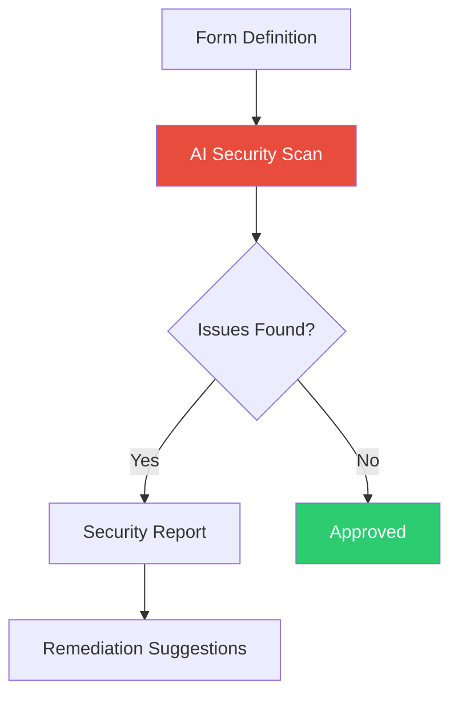

---

### E.4 AI Integration Architecture

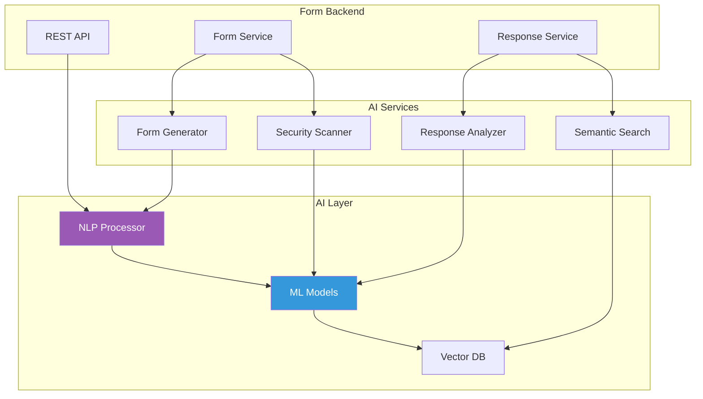

---

### E.5 Planned AI Endpoints

| Endpoint | Method | Description |
|----------|--------|-------------|
| `/ai/generate` | POST | Generate form from prompt |
| `/ai/suggest-fields` | POST | Suggest fields for section |
| `/ai/suggest-options` | POST | Generate options for field |
| `/ai/validate-form` | POST | AI validation of form structure |
| `/ai/search` | POST | Natural language search |
| `/ai/analyze` | POST | Analyze response data |
| `/ai/security-scan` | POST | Security audit of form |
| `/ai/extract-data` | POST | Extract structured data |

---

## Appendix F: User Management & Form Management Integration

This appendix details how User Management and Form Management systems integrate for comprehensive access control and workflow management.

### F.1 Integration Architecture

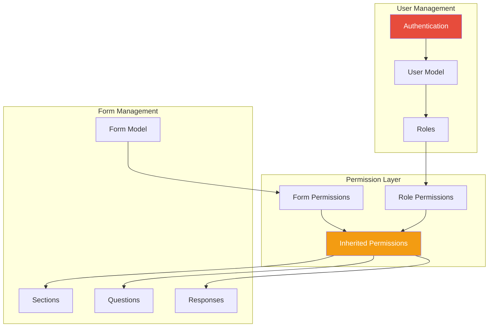

---

### F.2 Permission Inheritance Model

#### F.2.1 Three-Level Permission System

```
Level 1: System Roles (User Model)
    └── superadmin, admin, creator, editor, publisher, deo, user, general

Level 2: Form-Level Permissions (Form Model)
    └── editors[], viewers[], submitters[]

Level 3: Inherited Access (Computed at Runtime)
    └── Combination of Level 1 + Level 2
```

#### F.2.2 Permission Resolution Logic

```python
def has_form_permission(user, form, action):
    # Superadmin bypasses all checks
    if user.is_superadmin_check():
        return True
    
    # Check form-level permissions
    if action == "edit":
        return str(user.id) in form.editors
    
    if action == "view":
        return str(user.id) in form.viewers or str(user.id) in form.editors
    
    if action == "submit":
        return str(user.id) in form.submitters or form.is_public
    
    return False
```

#### F.2.3 Permission Matrix (Detailed)

| User Role | System Permission | Form Permission | Final Access |
|-----------|-------------------|-----------------|--------------|
| superadmin | Full | N/A | Full (always) |
| admin | Full | N/A | Full (always) |
| creator | Create forms | Auto-added as editor | Edit own forms |
| editor | Edit assigned | Must be in editors[] | Edit if assigned |
| user | Submit only | Must be in submitters[] | Submit if assigned |
| general | None | Public forms only | Submit public forms |

---

### F.3 User-Form Relationship Data Flow

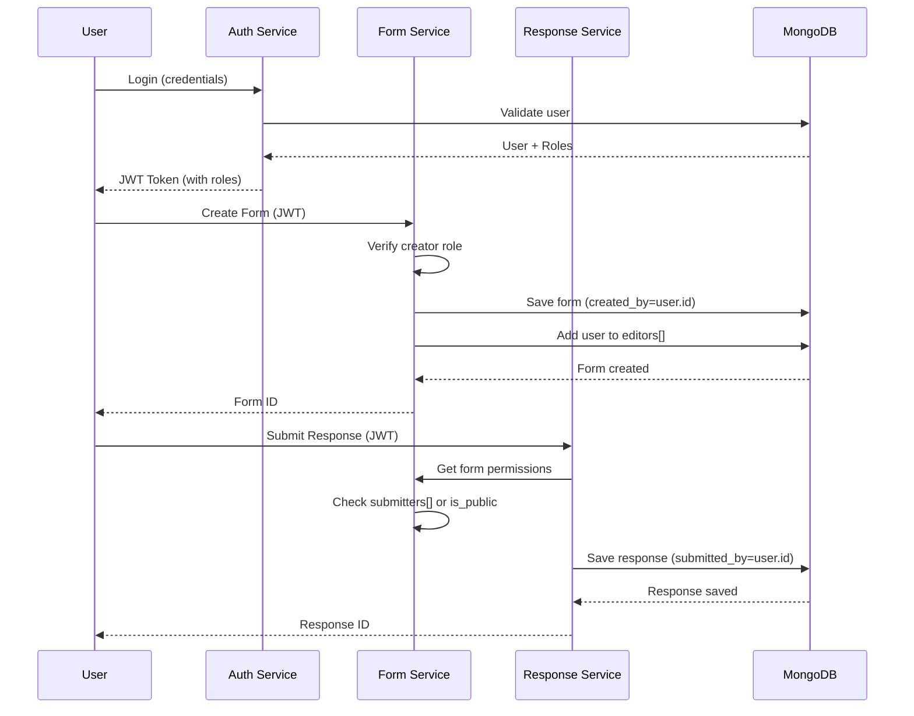

---

### F.4 Detailed User Management Features

#### F.4.1 User Lifecycle

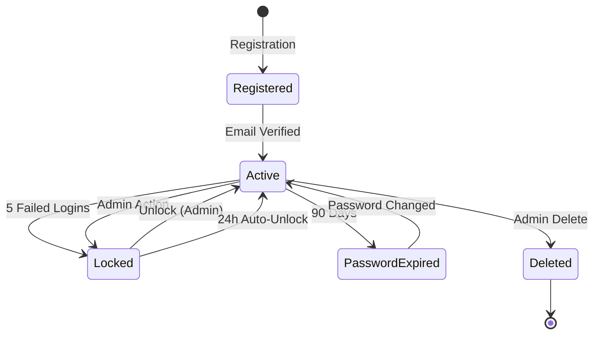

#### F.4.2 User Model Complete Reference

| Field | Type | Description | Impact on Forms |
|-------|------|-------------|-----------------|
| `id` | UUID | Unique identifier | Referenced in form permissions |
| `username` | String | Login identifier | Display in form creator/submitter |
| `email` | String | Email address | Used for notifications |
| `employee_id` | String | Organization ID | Can be collected in forms |
| `mobile` | String | Phone number | OTP authentication |
| `user_type` | Enum | employee/general | Determines auth method |
| `roles` | Array | System roles | Controls form operations |
| `is_active` | Boolean | Account status | Inactive = no form access |
| `is_admin` | Boolean | Admin flag | Full form access |
| `failed_login_attempts` | Integer | Security counter | Account lockout |
| `lock_until` | DateTime | Lock expiration | Temporary no access |
| `last_login` | DateTime | Activity tracking | Audit trail |

#### F.4.3 Role-Based Access Control (RBAC) Implementation

```python
# Decorator for role-based route protection
@require_roles('creator', 'admin')
def create_form():
    # Only users with creator or admin role can access
    pass

# Decorator with require_all flag
@require_roles('editor', 'publisher', require_all=True)
def publish_and_edit():
    # User must have BOTH roles
    pass
```

---

### F.5 Detailed Form Management Features

#### F.5.1 Form Lifecycle

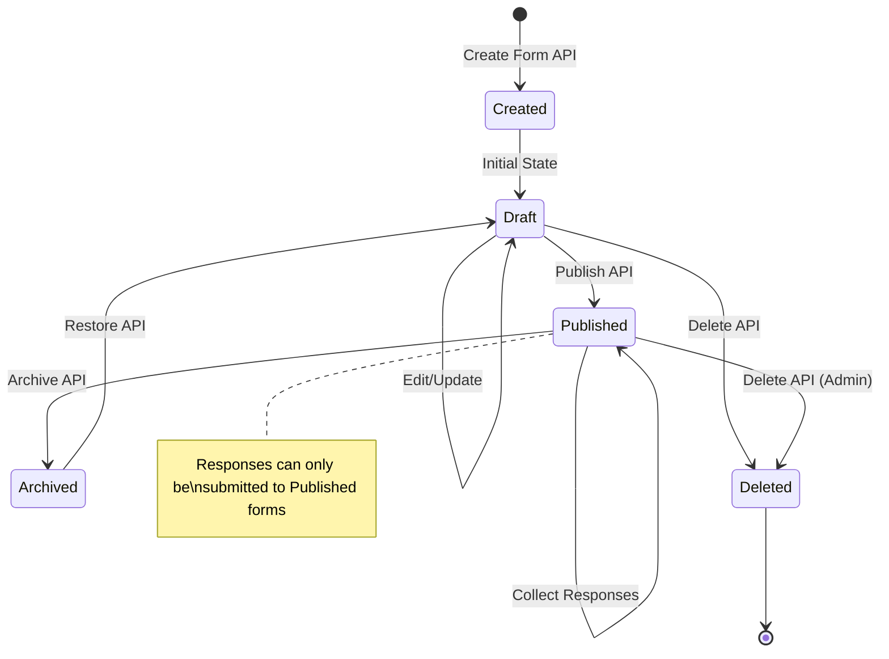

#### F.5.2 Form Model Complete Reference

| Field | Type | Description | User Integration |
|-------|------|-------------|------------------|
| `id` | UUID | Unique identifier | - |
| `title` | String | Display name | - |
| `slug` | String | URL identifier | - |
| `created_by` | String | Creator user ID | Links to User.id |
| `status` | Enum | draft/published/archived | Controls submission |
| `is_public` | Boolean | Anonymous access | Bypasses user check |
| `editors` | Array[String] | Edit permission | User.id references |
| `viewers` | Array[String] | View permission | User.id references |
| `submitters` | Array[String] | Submit permission | User.id references |
| `expires_at` | DateTime | Auto-expiration | Auto-archive |

#### F.5.3 Form-User Operations Matrix

| Operation | User Field Updated | Form Field Updated |
|-----------|-------------------|-------------------|
| Create Form | - | created_by, editors[] |
| Share Form | - | editors[], viewers[], submitters[] |
| Submit Response | - | FormResponse.submitted_by |
| Update Response | - | FormResponse.updated_by |
| Delete Response | - | FormResponse.deleted_by |
| Clone Form | - | created_by (new user) |

---

### F.6 Audit Trail & Activity Logging

#### F.6.1 Tracked Events

| Event | User Field | Form Field | Timestamp |
|-------|------------|------------|-----------|
| Form Created | created_by | forms.created_at | ✅ |
| Form Updated | - | forms.updated_at | ✅ |
| Form Published | - | forms.status | ✅ |
| Response Submitted | submitted_by | responses.submitted_at | ✅ |
| Response Updated | updated_by | responses.updated_at | ✅ |
| Response Deleted | deleted_by | responses.deleted_at | ✅ |
| User Login | last_login | - | ✅ |

#### F.6.2 Logging Integration

```python
# All actions are logged to app.log
current_app.logger.info(
    f"User {current_user.username} (ID: {current_user.id}) "
    f"created form {form.id}"
)
```

---

### F.7 Security Integration

#### F.7.1 Authentication → Authorization Flow

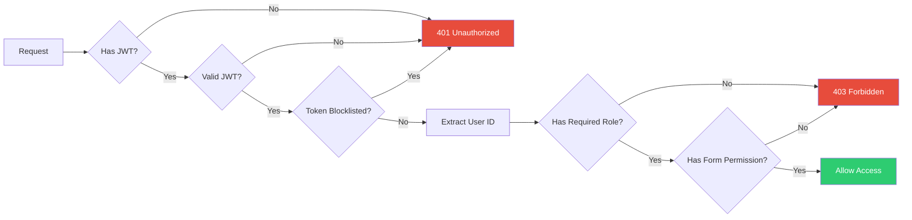

#### F.7.2 Security Boundaries

| Boundary | Protection | Enforcement |
|----------|------------|-------------|
| API Gateway | JWT Required | `@jwt_required()` |
| Route Level | Role Check | `@require_roles()` |
| Form Level | Permission Check | `has_form_permission()` |
| Field Level | Visibility Condition | Runtime evaluation |
| Data Level | Owner Check | `submitted_by == user.id` |

---

### F.8 Modularity & Extensibility

#### F.8.1 Module Architecture

```
app/
├── models/           # Data models (User, Form)
├── routes/
│   └── v1/
│       ├── auth_route.py    # Authentication
│       ├── user_route.py    # User management
│       └── form/            # Form management
│           ├── form.py      # CRUD operations
│           ├── responses.py # Response handling
│           ├── export.py    # Data export
│           └── api.py       # External integrations
├── services/         # Business logic (pluggable)
├── utils/            # Shared utilities
└── schemas/          # Data validation
```

#### F.8.2 Extension Points

| Extension Point | Location | Purpose |
|-----------------|----------|---------|
| Custom Field Types | `enumerations.py` | Add new field types |
| Custom API Calls | `api.py` | Add external integrations |
| Custom Validation | `responses.py` | Add validation logic |
| Custom Export | `export.py` | Add export formats |
| Custom Roles | `User.py` | Add new roles |

#### F.8.3 Plugin Architecture (Future)

```python
# Planned plugin interface
class FormPlugin:
    def on_form_create(self, form): pass
    def on_form_submit(self, form, response): pass
    def on_form_export(self, form, data): pass
    def validate_field(self, question, value): pass
```

---

**Document End**
