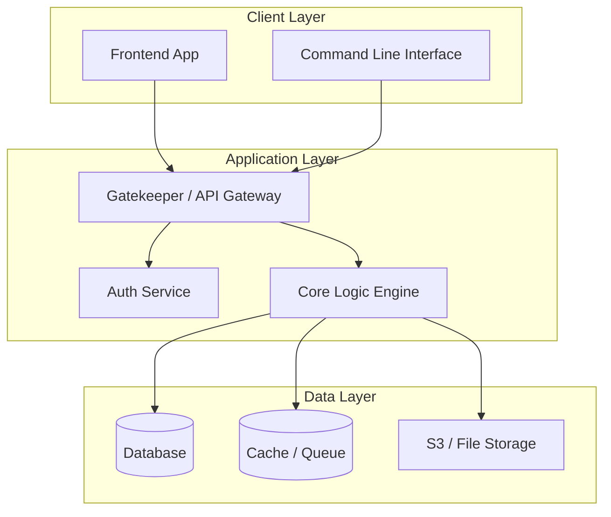

# Diagram: Architecture Overview (Mermaid)

## Purpose

High-level structural view of the system components and their relationships.

## Template

## How to use

1. Copy the mermaid block above.
2. Replace component names with project-specific names.
3. Add or remove subgraphs based on the system's complexity.
4. Save in `plans/Architecture/OVERVIEW.mermaid.md`.
