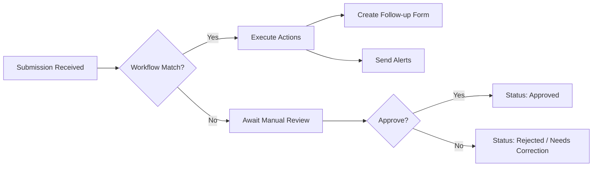

# Automated Workflow & Approval Flow

## Overview

The Automated Workflow & Approval Flow adds a layer of intelligence and process automation on top of basic data collection. It allows the system to **automatically respond** to incoming data by triggering specific events based on predefined logic. Whether it's escalating a high-priority incident, creating a new follow-up form for another department, or moving a submission through a multi-stage **Approval Pipeline** (Pending -> Approved/Rejected), this flow orchestrates the movement of information across the organization. By using the system's safe **Python evaluation engine**, administrators can build highly sophisticated "If-This-Then-That" scenarios that reduce manual administrative burden and ensure consistent operational standards.

## Step-by-Step Flow

### 1. Workflow Trigger

- Every final submission (non-draft) acts as a potential trigger.
- The system searches for **Active Workflows** associated with the specific `form_id`.

### 2. Condition Matching

- For each workflow, the `trigger_condition` is parsed and evaluated against the response data.
- Example: `answers['priority'] == 'Critical'`.
- If the condition returns `True`, the workflow proceeds to its actions.

### 3. Action Execution

- **Sub-Form Creation**: Automatically generates a new response for a target form, mapping data from the original (e.g., passing a Patient ID to a Treatment form).
- **Task Assignment**: Assigns the new record to a specific user or role for follow-up.
- **Notification**: Alerts stakeholders via email or integrated webhooks.

### 4. Administrative Review (Manual Approval)

- Editors view the "Pending" response in their Dashboard.
- After review, they call the `/status` endpoint with `approved` or `rejected`.
- A mandatory **Comment** is logged for accountability.

## Flow Diagram

## Examples

### Example 1: Escalation Workflow

1. User submits an "Equipment Failure" form.
2. Workflow Condition: `cost > 5000`.
3. **Action**: Auto-generate a "Budget Approval" form for the Finance team.
4. **Result**: Finance team sees a lead in their dashboard instantly.

### Example 2: Multi-Stage Approval

1. User submits a "Vacation Request".
2. Status is initially `pending`.
3. Manager reviews and updates status to `approved` with comment "Approved for March".
4. **Result**: Audit log shows: `Status: approved, By: ManagerX, Time: ...`.

### Example 3: Data Mapping Flow

1. Form A (Registration) maps `full_name` to Form B (ID Card Request).
2. User submits Form A with "John Doe".
3. Workflow creates Form B response.
4. **Result**: Form B response is pre-filled with "John Doe", saving time and reducing typing errors.

---
*Process Note: Workflows are evaluated in the order they are defined. A single submission can trigger multiple workflows if their conditions overlap.*
