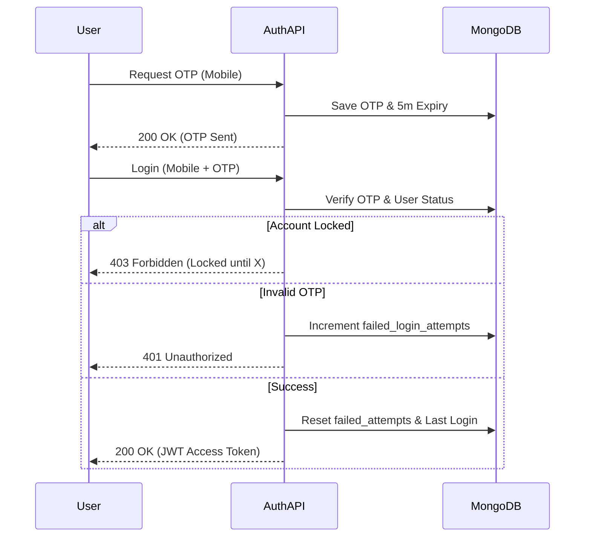

# Authentication & Security Flow

## Overview

The Authentication & Security Flow governs how users access the AIOS system and how their sessions are protected from unauthorized use. The system employs a **defense-in-depth** strategy, combining strong **JWT-based identity management** with automated protection mechanisms like **account lockout** and **OTP expiration**. This flow ensures that only authenticated and authorized personnel can interact with form data, while also providing a smooth experience for field users via mobile-friendly login options. Behind the scenes, the backend tracks failed attempts, monitors password age, and maintains a real-time token blocklist to invalidate sessions immediately upon logout or security breach.

## Step-by-Step Flow

### 1. User Registration (Admin/Self-Service)

- User provides a unique **Email**, **Username**, and **Mobile Number**.
- Backend validates uniqueness and hashes the **Password** using **Bcrypt**.
- Default roles and permissions are assigned based on the `user_type`.

### 2. Login Sequence

- **Password Strategy**: User submits credentials (`email` + `password`). Backend verifies hash.
- **OTP Strategy**:
  - User requests OTP via `/generate-otp`.
  - System generates a 6-digit code and sets a 5-minute expiry.
  - User submits code via `/login`.
- **Validation**: System checks if the account is `locked` (too many failed attempts) or if the `password_expiration` date has passed.

### 3. Session Issuance (JWT)

- Upon successful validation, the system generates a **JWT Access Token**.
- The token includes **Claims** like `roles` and `id`, used for RBAC (Role-Based Access Control).
- Token is returned in the JSON response and optionally set as a secure cookie.

### 4. Continuous Protection

- Every future request is intercepted by the `@jwt_required` decorator.
- The JTI (Unique Token ID) is checked against the **Blocklist**.
- If a user fails to login 5 times consecutively, the account is automatically locked for a cooling-off period.

## Flow Diagram

## Examples

### Example 1: Successful OTP Login

1. User requests OTP for `9876543210`.
2. Backend saves `123456` in DB.
3. User logs in with `9876543210` and `123456`.
4. **Result**: JWT issued.

### Example 2: Account Lockout

1. User attempts login with wrong password 5 times.
2. `failed_login_attempts` hits 5.
3. `lock_until` is set to `now + 30 minutes`.
4. **Result**: Subsequent attempts return 403.

### Example 3: Password Expiration

1. Admin sets password policy to 90 days.
2. User login attempt occurs on Day 91.
3. **Result**: 403 Forbidden ("Password expired").
