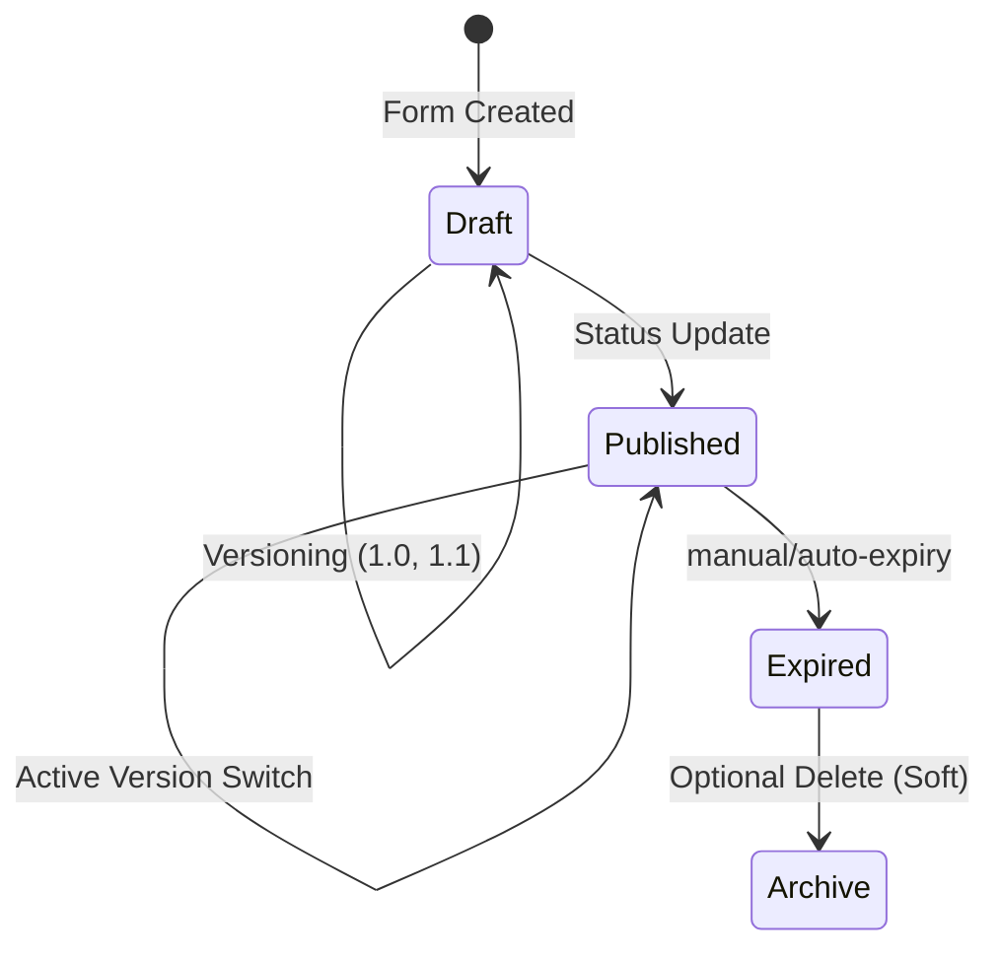

# Form Lifecycle & Versioning Flow

## Overview

The Form Lifecycle & Versioning Flow manages the evolutionary path of a form from its initial conception to its eventual retirement. Unlike static form systems, AIOS supports a **highly dynamic state machine** coupled with **atomic versioning**. This allows creators to update schemas (add questions, change validation, reorder sections) while maintaining the integrity of historical data. The lifecycle ensures that only "Published" forms are accessible to field users, and "Expired" forms automatically stop accepting submissions. Versioning specifically prevents "breaking changes" by ensuring that each response is permanently linked to the exact schema version present at the time of submission.

## Step-by-Step Flow

### 1. Draft Creation

- A Creator initializes a form shell with a `title` and unique `slug`.
- The form starts in the `draft` state (invisible to users).

### 2. Version Definition

- One or more `FormVersion` documents are added to the form.
- Each version contains the full hierarchy of **Sections** and **Questions**.
- One version is marked as `active_version`.

### 3. Publication

- The creator updates the form status to `published`.
- Optional: Set `publish_at` (future date) and `expires_at`.
- The form is now reachable via the Public/Authenticated API for submission.

### 4. Continuous Iteration

- To make changes, a new version (e.g., `2.0`) is created.
- The new version is tested while `1.0` remains active for live submissions.
- Switching `active_version` to `2.0` instantly updates the live form UI for new respondents.

### 5. Expiration & Archival

- Once the collection period ends, the status changes to `expired`.
- The system prevents any further submissions but maintains "Read-only" access for analytics.

## Flow Diagram

## Examples

### Example 1: Rolling out an Update

1. Form "Patient Intake" is live on `v1.0`.
2. Creator adds "Emergency Contact" question in `v1.1`.
3. Creator calls `/activate` for `v1.1`.
4. **Result**: New users see the contact field; old responses remain valid under `v1.0`.

### Example 2: Scheduled Survey

1. Admin sets `publish_at` to March 1st.
2. User tries to access API on Feb 28th.
3. **Result**: 403 Forbidden ("Form is not yet available").

### Example 3: Template Cloning

1. HR creates a "Standard Interview" form and marks it `is_template: true`.
2. Finance Manager clones it using `/clone`.
3. **Result**: New form is created in `draft` state with a custom slug for Finance use.
