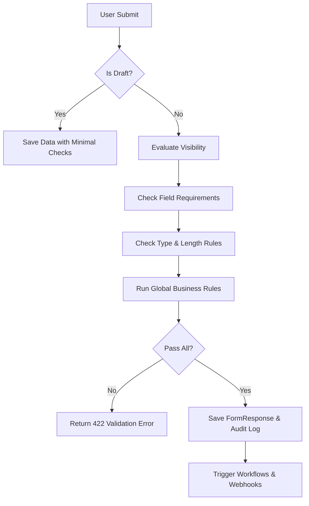

# Submission & Validation Flow

## Overview

The Submission & Validation Flow is the "quality control" heart of the AIOS platform. It handles the transition of user input from the client into a permanent, validated record in the database. The system uses a **recursive validation engine** that checks data integrity at multiple levels: **Field Type** (Number vs String), **Logical Visibility** (skipping hidden fields), **Conditional Requirements**, and **Global Business Rules**. This flow ensures that only high-quality, authorized data enters the system. It also supports specialized features like **Draft Saving** (partial submission without validation) and **History Tracking**, which creates an immutable trail of every change made to a response.

## Step-by-Step Flow

### 1. Payload Reception

- API receives a `POST` request (JSON or Multipart for files).
- The system identifies the target **Form** and its currently **Active Version**.

### 2. Visibility Evaluation

- The validator iterates through everyone of the sections and questions.
- It evaluates the `visibility_condition` for each item.
- **Critical**: Hidden fields are skipped and removed from the final data to prevent "stale" data injection.

### 3. Deep Validation

- **Requirement Check**: Checks if mandatory fields are filled (or if a `required_condition` is met).
- **Type Check**: Ensures numbers are digits, file uploads are valid objects, and checkbox values are lists.
- **Rule Check**: Applies regex or custom min/max length/selection limits.

### 4. Global Cross-Validation

- After checking individual fields, the system runs **Global Rules** (e.g., "Field A must be greater than Field B").
- These rules can access the entire submission context.

### 5. Final Persistance

- If valid, a `FormResponse` is created.
- The `ResponseHistory` is updated with a `create` entry.
- **Triggers**: Automated Webhooks and Email notifications are fired if the submission is a final (non-draft) entry.

## Flow Diagram

## Examples

### Example 1: Conditional Visibility

1. Form asks: "Do you have allergies?" (Yes/No).
2. If 'Yes', "Describe Allergies" appears.
3. User selects 'No' but sends text for "Describe Allergies" via API.
4. **Result**: Validator identifies the field as hidden and strips the text before saving.

### Example 2: Repeatable Section Validation

1. Section "Family Members" has `repeat_min: 1`.
2. User submits an empty list `[]`.
3. **Result**: 422 Error - "At least 1 entries required".

### Example 3: Global Business Rule

1. Rule: `check_in_date < check_out_date`.
2. User submits Check-in as March 10th and Check-out as March 5th.
3. **Result**: 422 Error - "Check-out must be after check-in".
