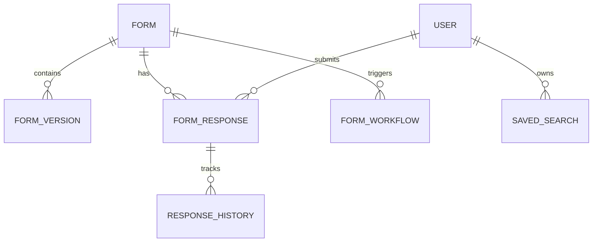

# Schemas & Models

This section documents the MongoDB data models (using MongoEngine) that define the structural integrity of the AIOS platform. Our models follow a **highly nested and modular design**, allowing for complex relationships while maintaining high performance.

## Core Models

### [Form](./Form.md)

The central document defining form metadata, permissions (RBAC), and global settings like webhooks and notifications.

### [FormVersion](./FormVersion.md)

An embedded document within a Form that contains the actual schema (Sections and Questions). Supporting multiple versions allows for historical response integrity.

### [FormResponse](./FormResponse.md)

Stores individual user submissions, linked to a specific Form and Version. Includes status tracking, approval logs, and AI analysis results.

### [User](./User.md)

The identity model handling authentication (password/OTP), security roles, and account state (locked/active).

## Support Models

- **ResponseHistory**: An immutable log of all changes to any response, used for auditing.
- **SavedSearch**: User-defined filter presets for the response search engine.
- **TokenBlocklist**: Tracks invalidated JWTs to ensure immediate session termination on logout.
- **Dashboard**: Defines layout and configurations for administrative data visualization.
- **FormWorkflow**: Logic definitions for automated triggers and actions.

## Data Relationships

---
*Technical Note: All models use non-binary UUIDs as primary keys to ensure cross-system compatibility and readable identifiers.*
