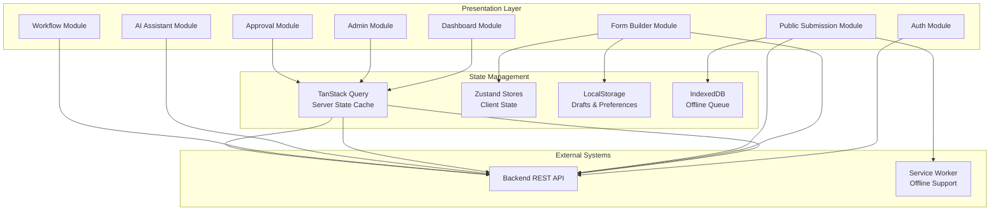

# Combined Frontend SRS (Enhanced)

## Table of Contents

1. [Introduction](#1-introduction)
2. [System Overview](#2-system-overview)
3. [User Roles &amp; Interfaces](#3-user-roles--interfaces)
4. [Functional Requirements](#4-functional-requirements)
5. [Non-Functional Requirements](#5-non-functional-requirements)
6. [UI Component Architecture](#6-ui-component-architecture)
7. [Data Models &amp; Type Definitions](#7-data-models--type-definitions)
8. [API Endpoints Reference](#8-api-endpoints-reference)
9. [Validation Specifications](#9-validation-specifications)
10. [Security &amp; Privacy](#10-security--privacy)
11. [Error Handling Strategy](#11-error-handling-strategy)
12. [Testing Requirements](#12-testing-requirements)
13. [Deployment, CI-CD and Operations](#13-deployment-ci-cd-and-operations)
14. [Monitoring, Analytics &amp; Observability](#14-monitoring-analytics--observability)
15. [Environment &amp; Configuration](#15-environment--configuration)
16. [Appendices](#16-appendices)
17. [Detailed Expansions and Missing Details](#17-detailed-expansions-and-missing-details)
18. [Traceability Matrix](#18-traceability-matrix)

---

## 1. Introduction

### 1.1 Purpose

This document defines the **complete Software Requirements Specification (SRS)** for the **Form Management System - Frontend**. It is the single source of truth for developers, designers, QA engineers, product owners, and DevOps staff.

### 1.2 Scope

The Frontend Application provides:

- Form Builder (drag-and-drop UI with AI assistance)
- Dashboard (role-based analytics and quick actions)
- Public Submission (PWA-enabled, accessible forms)
- Response Management (grid, filtering, export, approvals)
- Integrations (UHID lookup, OTP verification, custom APIs)
- AI Assistant (conversational form generation)
- Workflow Automation (visual node editor)

### 1.3 Intended Audience

| Role                | Reason                                            |
| ------------------- | ------------------------------------------------- |
| Frontend Developers | Implementation details and component contracts    |
| UI/UX Designers     | Wireframes, interaction patterns, accessibility   |
| QA Engineers        | Test cases, validation rules, performance budgets |
| Backend Developers  | API contracts, data model alignment               |
| Product Managers    | Feature scope and roadmap                         |
| DevOps / SRE        | Deployment pipeline, monitoring, observability    |
| Security Auditors   | Threat model, CSP, XSS/CSRF mitigations           |

### 1.4 Conventions

- **Bold** - UI labels, API endpoints, env vars.
- ``code`` - inline snippets.
- ``typescript`` - code blocks.
- Mermaid diagrams are used for architecture visualisation.
- Numeric heading hierarchy throughout.

---

## 2. System Overview

### 2.1 High-Level Architecture



### 2.2 Module Responsibilities

| Module              | Core Responsibilities                                                         |
| ------------------- | ----------------------------------------------------------------------------- |
| Authentication      | Login (password/OTP), registration, session refresh, logout                   |
| Dashboard           | Role-based widgets, real-time stats, drag-to-reorder for admins               |
| Form Builder        | Drag-and-drop library, properties panel, conditional logic, versioning        |
| Public Submission   | ISR-rendered forms, client-side Zod validation, file upload, auto-save drafts |
| Response Management | Data grid with pagination, bulk export, detail view                           |
| Approval Workflow   | Timeline UI, multi-step approvals, comments, history                          |
| AI Assistant        | Chat-based form generation, field suggestions                                 |
| Workflow Automation | Visual node editor (React Flow), triggers & actions                           |

---

## 3. User Roles & Interfaces

### 3.1 Access Matrix

| User Role  | Access Level      | Primary Views                     | Key Capabilities                          |
| ---------- | ----------------- | --------------------------------- | ----------------------------------------- |
| Superadmin | Full System       | All modules                       | System config, user management, all forms |
| Admin      | Administrative    | Dashboard, Admin Panel, All Forms | User management, workflow config          |
| Creator    | Content Creation  | Dashboard, Builder, Responses     | Create/edit own forms, AI generation      |
| Editor     | Content Editing   | Dashboard, Builder (assigned)     | Edit assigned forms, view responses       |
| Publisher  | Publishing        | Dashboard, Form List              | Publish/unpublish forms                   |
| Manager    | Approval & Review | Dashboard, Responses, Approvals   | Approve/reject submissions                |
| DEO        | Data Entry        | Public Submission (authenticated) | Submit form responses                     |
| User       | Basic             | Dashboard (limited), Submission   | Submit to assigned forms                  |
| Respondent | Public            | Public Submission Pages           | Submit to public forms                    |

### 3.2 Navigation Structure

#### Unauthenticated routes

- `/` - Landing page
- `/login` - Email/Password or Mobile + OTP login
- `/register` - Employee self-service registration
- `/forgot-password` - Reset flow
- `/submit/[slug]` - Public form (PWA-enabled)

#### Authenticated layout

```text
├── Sidebar
│   ├── 🏠 Dashboard
│   ├── 📋 My Forms
│   ├── 📊 Responses
│   ├── ✅ Approvals (Manager only)
│   ├── 🔄 Workflows (Admin only)
│   ├── 🤖 AI Assistant
│   └── ⚙️ Settings
├── Header
│   ├── Global Search
│   ├── Notifications (🔔)
│   ├── Theme Toggle (🌙)
│   └── User Menu (profile, logout)
└── Content Area (router outlet)
```

#### Form Builder isolated layout

```text
Header (title, save status, preview toggle, version dropdown, publish)
Left Sidebar - Component Library
Canvas - Drag-and-drop workspace (sections & questions)
Right Sidebar - Properties Panel (field settings, validation, conditional logic)
```

---

## 4. Functional Requirements

### 4.1 Authentication

| FR                 | Description                                                                                                        |
| ------------------ | ------------------------------------------------------------------------------------------------------------------ |
| FR-FRONT-AUTH-01   | Multi-method login (email + password or mobile + OTP). Stores JWT in HttpOnly cookie and mirrors token in Zustand. |
| FR-FRONT-AUTH-02   | Self-service registration for employees with password-strength validation.                                         |
| FR-FRONT-AUTH-03   | OTP flow: generate, countdown, auto-submit on 6th digit, lock after 5 attempts.                                    |
| FR-FRONT-AUTH-04   | Session init on app mount, auto-refresh via cookie, graceful logout on 401.                                        |
| FR-FRONT-AUTH-05   | Logout clears cookie, Zustand store, localStorage and redirects to `/login`.                                       |
| **Business Rules** |                                                                                                                    |

- Remember last login method in `localStorage`.
- Lockout after 5 failed OTP attempts for 24 h.
- “Remember Me” extends token expiry to 30 days.

### 4.2 Dashboard

| FR                                               | Description                                                                                                                                                    |
| ------------------------------------------------ | -------------------------------------------------------------------------------------------------------------------------------------------------------------- |
| FR-FRONT-DASH-01                                 | Role-based widget grid (stats cards, recent forms, pending approvals, submission chart, quick actions). 12-column responsive; admins can drag-reorder widgets. |
| FR-FRONT-DASH-02                                 | Form Management grid with sortable, filterable columns, server-side pagination, bulk actions (export, delete, clone).                                          |
| All widgets share the same TanStack Query cache. |                                                                                                                                                                |

### 4.3 Form Builder

| FR               | Description                                                                                                                                         |
| ---------------- | --------------------------------------------------------------------------------------------------------------------------------------------------- |
| FR-FRONT-BLDR-01 | Drag-and-drop using `@dnd-kit/core`. Source → Canvas → Trash. Visual feedback and keyboard alternative for accessibility.                           |
| FR-FRONT-BLDR-02 | Exhaustive field-type library (text, choice, date/time, rating, boolean, file, integration, layout).                                                |
| FR-FRONT-BLDR-03 | Context-sensitive Properties Panel (common, type-specific, advanced settings).                                                                      |
| FR-FRONT-BLDR-04 | Conditional Logic Builder - visual UI to compose expressions, supports AND/OR, parentheses, prevents circular dependencies.                         |
| FR-FRONT-BLDR-05 | Preview Mode - toggles edit/live preview, runs full validation, shows API sandbox.                                                                  |
| FR-FRONT-BLDR-06 | Version Management - dropdown of versions, create new version (clone + increment), restore, side-by-side diff view with response count per version. |
| FR-FRONT-BLDR-07 | Repeatable Sections/Questions - UI for dynamic add/remove, min/max enforcement, drag-reorder handles.                                               |

### 4.4 Public Submission

| FR              | Description                                                                                               |
| --------------- | --------------------------------------------------------------------------------------------------------- |
| FR-FRONT-PUB-01 | ISR-rendered form engine (`/submit/[slug]`). Handles 404/expired forms, loading skeleton, fallback.       |
| FR-FRONT-PUB-02 | Client-side Zod validation (onBlur, onChange, onSubmit). Generates schema from backend field definitions. |
| FR-FRONT-PUB-03 | Draft auto-save to `localStorage` (debounced 1 s). Prompt to resume on mount.                             |
| FR-FRONT-PUB-04 | File upload - size < 10 MB, MIME whitelist, progress bar, multi-file support, error retry UI.             |
| FR-FRONT-PUB-05 | UHID lookup integration - API call, loading state, auto-fill confirmation dialog.                         |
| FR-FRONT-PUB-06 | SMS OTP verification - timer, resend cooldown, auto-submit on full entry, state-machine diagram.          |

### 4.5 Response Management

| FR               | Description                                                                                                                        |
| ---------------- | ---------------------------------------------------------------------------------------------------------------------------------- |
| FR-FRONT-RESP-01 | Advanced data grid (TanStack Table) with column visibility, resizing, reordering, row selection, bulk export (CSV/JSON/PDF/Excel). |
| FR-FRONT-RESP-02 | Advanced filtering UI - multi-criteria builder, server-side search endpoint.                                                       |
| FR-FRONT-RESP-03 | Response detail view - split layout, status actions, history timeline.                                                             |
| FR-FRONT-RESP-04 | Export functionality - selectable formats, streaming download, progress indicator.                                                 |

### 4.6 Approval Workflow

| FR               | Description                                                                                                        |
| ---------------- | ------------------------------------------------------------------------------------------------------------------ |
| FR-FRONT-APPR-01 | Visual timeline (stepper) showing current status, timestamps, and actor.                                           |
| FR-FRONT-APPR-02 | Approve/Reject/Send-Back UI with mandatory comment for reject/send-back, confirmation modal, optimistic UI update. |

### 4.7 AI & Smart Features

| FR             | Description                                                                          |
| -------------- | ------------------------------------------------------------------------------------ |
| FR-FRONT-AI-01 | Conversational form generator - chat UI, AI-generated schema, preview & accept flow. |
| FR-FRONT-AI-02 | Smart field suggestions - context-aware prompts (e.g., suggest country list).        |

### 4.8 Workflow Automation

| FR               | Description                                                                                                                                       |
| ---------------- | ------------------------------------------------------------------------------------------------------------------------------------------------- |
| FR-FRONT-WORK-01 | Node-based visual editor (React Flow). Nodes: Trigger, Condition, Action. Supports drag-and-drop, inline editing, circular-dependency validation. |
| FR-FRONT-WORK-02 | Example workflow - age-based consent form creation after patient registration.                                                                    |

---

## 5. Non-Functional Requirements

### 5.1 Performance

| Metric                                                                                                                 | Target          | Tool                         |
| ---------------------------------------------------------------------------------------------------------------------- | --------------- | ---------------------------- |
| LCP                                                                                                                    | < 2.5 s         | Lighthouse, Vercel Analytics |
| FID                                                                                                                    | < 100 ms        | CrUX, Lighthouse             |
| CLS                                                                                                                    | < 0.1           | Lighthouse                   |
| TTI                                                                                                                    | < 3.5 s         | Lighthouse                   |
| Initial Bundle Size                                                                                                    | < 150 KB (gzip) | Webpack Bundle Analyzer      |
| API Rendering                                                                                                          | < 200 ms        | Custom metrics               |
| Form (100 fields)                                                                                                      | < 1 s           | In-house benchmark           |
| Search/Filter                                                                                                          | < 500 ms        | Load test scripts            |
| **Optimization** - route-based code splitting, component lazy loading, `next/image`, font `swap`, server-side caching. |                 |                              |

### 5.2 Accessibility (WCAG 2.1 AA)

- Keyboard navigation, focus management, ARIA live regions, contrast ≥ 4.5:1.
- Shortcuts: `Ctrl+S` (save), `Ctrl+P` (preview), `Esc` (close modal).
- Focus trap in modals/popovers.
- Screen-reader announcements for errors and dynamic updates.
- Color palette verified with `axe-core`.

### 5.3 Browser Compatibility

| Browser                                                             | Minimum Version |
| ------------------------------------------------------------------- | --------------- |
| Chrome                                                              | 90              |
| Firefox                                                             | 88              |
| Safari                                                              | 14              |
| Edge                                                                | 90              |
| Mobile Safari (iOS)                                                 | 14              |
| Chrome Android                                                      | 8               |
| No polyfills required; Vite’s `browserslist` handles transpilation. |                 |

### 5.4 PWA

- Manifest (`public/manifest.json`).
- Service Worker (Workbox) with `CacheFirst` for assets, `NetworkFirst` for API, `StaleWhileRevalidate` for HTML.
- Background Sync for offline submissions.
- Add-to-Home-Screen prompt (Chrome/Edge).

---

## 6. UI Component Architecture

- Design System - Tailwind utilities, custom `@layer components`.
- Component Library - Shadcn UI (Radix primitives).
- Atomic Design - atoms, molecules, organisms, templates, pages.
- State Management - TanStack Query (server) + Zustand (client).
- Theming - CSS variables for light/dark, `prefers-color-scheme`, persisted toggle.

---

## 7. Data Models & Type Definitions

```typescript
export enum UserType { EMPLOYEE = 'employee', GENERAL = 'general' }
export enum UserRole { SUPERADMIN = 'superadmin', ADMIN = 'admin', CREATOR = 'creator', EDITOR = 'editor', PUBLISHER = 'publisher', DEO = 'deo', USER = 'user', GENERAL = 'general', MANAGER = 'manager' }
export enum FormStatus { DRAFT = 'draft', PUBLISHED = 'published', ARCHIVED = 'archived' }
export enum FieldType { INPUT = 'input', TEXTAREA = 'textarea', SELECT = 'select', RADIO = 'radio', CHECKBOX = 'checkbox', DATE = 'date', RATING = 'rating', FILE_UPLOAD = 'file_upload', BOOLEAN = 'boolean', API_SEARCH = 'api_search', CALCULATED = 'calculated' }

export interface IUser {
  id: string;
  username: string;
  email: string;
  employee_id?: string;
  mobile: string;
  user_type: UserType;
  roles: UserRole[];
  is_active: boolean;
  is_admin: boolean;
  is_email_verified: boolean;
  failed_login_attempts: number;
  lock_until?: Date;
  last_login?: Date;
  password_expiration?: Date;
  created_at: Date;
  updated_at: Date;
}

export interface IForm {
  id: string;
  title: string;
  description?: string;
  slug: string;
  created_by: string;
  status: FormStatus;
  ui: 'flex' | 'grid-cols-2' | 'tabbed' | 'custom';
  is_public: boolean;
  approval_enabled: boolean;
  approval_steps?: IApprovalStep[];
  versions: IFormVersion[];
  tags?: string[];
  editors: string[];
  viewers: string[];
  submitters: string[];
  expires_at?: Date;
  created_at: Date;
  updated_at: Date;
}
// Additional interfaces omitted for brevity
```

---

## 8. API Endpoints Reference

| Method | Endpoint                                   | Auth       | Request Body                                                           | Response                                 | Usage             |
| ------ | ------------------------------------------ | ---------- | ---------------------------------------------------------------------- | ---------------------------------------- | ----------------- |
| POST   | `/api/v1/auth/register`                    | ❌         | `{ username, email, employee_id, mobile, password, confirm_password }` | `{ message }`                            | FR-FRONT-AUTH-02  |
| POST   | `/api/v1/auth/login`                       | ❌         | `{ email, password }` **or** `{ mobile, otp }`                         | `{ access_token, user }`                 | FR-FRONT-AUTH-01  |
| POST   | `/api/v1/auth/generate-otp`                | ❌         | `{ mobile }`                                                           | `{ message }`                            | FR-FRONT-AUTH-03  |
| POST   | `/api/v1/auth/logout`                      | ✅         | `{}`                                                                   | `{ message }`                            | FR-FRONT-AUTH-05  |
| GET    | `/api/v1/user/status`                      | ✅         | -                                                                      | `IUser`                                  | FR-FRONT-AUTH-04  |
| POST   | `/api/v1/form/`                            | ✅         | `Partial<IForm>`                                                       | `{ form_id }`                            | Builder create    |
| GET    | `/api/v1/form/`                            | ✅         | -                                                                      | `IForm[]`                                | List forms        |
| GET    | `/api/v1/form/{id}`                        | ✅         | -                                                                      | `IForm`                                  | Load/edit         |
| PUT    | `/api/v1/form/{id}`                        | ✅         | `Partial<IForm>`                                                       | `{ message }`                            | Update            |
| DELETE | `/api/v1/form/{id}`                        | ✅         | -                                                                      | `{ message }`                            | Delete            |
| PATCH  | `/api/v1/form/{id}/publish`                | ✅         | -                                                                      | `{ message }`                            | Publish           |
| POST   | `/api/v1/form/{id}/clone`                  | ✅         | -                                                                      | `{ form_id }`                            | Clone             |
| POST   | `/api/v1/form/{id}/responses`              | ✅         | `{ data: Record<string, any> }`                                        | `{ response_id }`                        | Auth submit       |
| POST   | `/api/v1/form/{id}/public-submit`          | ❌         | `{ data: Record<string, any> }`                                        | `{ response_id }`                        | Public submit     |
| GET    | `/api/v1/form/{id}/responses`              | ✅         | `?page=&limit=`                                                        | `PaginatedResponse<IFormResponse>`       | List responses    |
| GET    | `/api/v1/form/{id}/responses/{rid}`        | ✅         | -                                                                      | `IFormResponse`                          | Detail            |
| POST   | `/api/v1/form/{id}/files/{qid}`            | ✅ (cond.) | `multipart/form-data`                                                  | `{ filename, filepath, size }`           | File upload       |
| GET    | `/api/v1/form/{id}/files/{qid}/{filename}` | ✅ (cond.) | -                                                                      | File stream                              | Download          |
| GET    | `/api/v1/approvals/pending`                | ✅         | -                                                                      | `IFormResponse[]`                        | Pending approvals |
| POST   | `/api/v1/approvals/{responseId}/action`    | ✅         | `{ action, comment, step_id }`                                         | `{ message }`                            | Approve/Reject    |
| GET    | `/api/v1/approvals/{responseId}/history`   | ✅         | -                                                                      | `IApprovalAction[]`                      | History           |
| GET    | `/api/v1/form/{id}/export/csv`             | ✅         | -                                                                      | `text/csv`                               | CSV export        |
| GET    | `/api/v1/form/{id}/export/json`            | ✅         | -                                                                      | `application/json`                       | JSON export       |
| GET    | `/api/v1/form/{id}/analytics`              | ✅         | -                                                                      | `{ total_responses, latest_submission }` | Dashboard stats   |
---

## 9. Validation Specifications

### 9.1 Dynamic Zod Schema

```typescript
import { z } from 'zod';
import type { IForm, IQuestion, FieldType } from '@/types';

export const generateFormSchema = (form: IForm) => {
  const schema: Record<string, z.ZodTypeAny> = {};
  const latest = form.versions[form.versions.length - 1];
  latest.sections.forEach(section => {
    section.questions.forEach(q => {
      if (q.visibility_condition) return;
      let field: z.ZodTypeAny;
      switch (q.field_type) {
        case FieldType.INPUT:
        case FieldType.TEXTAREA:
          field = z.string();
          const rules = JSON.parse(q.validation_rules || '{}');
          if (q.is_required) field = field.min(1, 'Required');
          if (rules.min_length) field = field.min(rules.min_length);
          if (rules.max_length) field = field.max(rules.max_length);
          if (rules.pattern) field = field.regex(new RegExp(rules.pattern), 'Invalid format');
          break;
        case FieldType.NUMBER:
          field = z.number();
          break;
        case FieldType.SELECT:
        case FieldType.RADIO:
          const opts = q.options?.map(o => o.option_value) ?? [];
          field = z.enum(opts as [string, ...string[]]);
          break;
        case FieldType.CHECKBOX:
          const chk = q.options?.map(o => o.option_value) ?? [];
          field = z.array(z.enum(chk as [string, ...string[]]));
          break;
        case FieldType.FILE_UPLOAD:
          field = z.object({ filename: z.string(), filepath: z.string(), size: z.number() });
          break;
        default:
          field = z.any();
      }
      schema[q.id] = field;
    });
  });
  return z.object(schema);
};
```

### 9.2 Common Rules

- Email - `z.string().email()`
- Phone (India) - `/^[6-9]\d{9}$/`
- Password - min 8, uppercase, number, special char.
- Conditional required - custom `superRefine`.

---

## 10. Security & Privacy

- CSP defined in `next.config.js`.
- XSS protection via React auto-escaping + DOMPurify.
- CSRF mitigation - SameSite Strict cookies, `X-CSRF-Token` header.
- Rate limiting - 60 req/min per IP, UI shows retry-after.
- TLS 1.3 for all traffic; at-rest encryption via cloud KMS.
- GDPR-compliant; users can request data export/delete.

---

## 11. Error Handling Strategy

- Categorisation: Network, Validation, Auth, Authz, 404, 5xx, Rate-limit.
- React Error Boundary (see code snippet in Appendix F).
- API interceptor for uniform error objects.
- Retry utility `withRetry` with exponential back-off.
- Offline queue via Workbox background sync.

---

## 12. Testing Requirements

- **Unit** (Vitest) - ≥ 80 % overall, ≥ 90 % for core modules.
- **Component** (React Testing Library) - ARIA, focus, props.
- **E2E** (Playwright) - full user flows, performance tracing.
- **Accessibility** (axe-playwright) - run on every PR.
- CI pipeline runs lint → unit → component → e2e → accessibility.

---

## 13. Deployment, CI-CD and Operations

### 13.1 Build

1. `npm run lint`
2. `npm run build`
3. `npm run export` (optional static export)

### 13.2 GitHub Actions

```yaml
name: Frontend CI/CD
on: [push, pull_request]
jobs:
  build-test:
    runs-on: ubuntu-latest
    steps:
      - uses: actions/checkout@v3
      - uses: actions/setup-node@v3
        with:
          node-version: '20'
      - run: npm ci
      - run: npm run lint
      - run: npm run test:unit
      - run: npm run test:component
      - run: npm run test:e2e
      - run: npm run build
      - name: Deploy to Vercel
        uses: amondnet/vercel-action@v20
        with:
          vercel-token: ${{ secrets.VERCEL_TOKEN }}
          vercel-org-id: ${{ secrets.VERCEL_ORG_ID }}
          vercel-project-id: ${{ secrets.VERCEL_PROJECT_ID }}
          working-directory: .
```

### 13.3 Environments

| Env         | URL                          | Config             |
| ----------- | ---------------------------- | ------------------ |
| Development | `dev.formms.example.com`     | `.env.development` |
| Staging     | `staging.formms.example.com` | `.env.staging`     |
| Production  | `app.formms.example.com`     | `.env.production`  |

### 13.4 Rollback

1. Trigger Vercel “Rollback”.
2. Verify `/api/health` returns 200.
3. Notify via Slack webhook.

---

## 14. Monitoring, Analytics & Observability

| Metric                                                                         | Source               | Alert                   |
| ------------------------------------------------------------------------------ | -------------------- | ----------------------- |
| LCP/FID/CLS                                                                    | Vercel Analytics     | LCP > 3 s, FID > 200 ms |
| API Latency                                                                    | Grafana (Prometheus) | > 500 ms (p95)          |
| Error Rate                                                                     | Sentry               | > 1 % of requests       |
| CPU/Memory                                                                     | CloudWatch           | CPU > 80 % for 5 min    |
| Queue Length                                                                   | Workbox Queue        | > 100 pending           |
| Logging: frontend via `loglevel` → Sentry/LogRocket; backend JSON logs to ELK. |                      |                         |
| Alerting via Slack `#frontend-alerts` and PagerDuty.                           |                      |                         |
| Dashboards in Grafana and Mixpanel for feature usage.                          |                      |                         |

---

## 15. Environment & Configuration

### 15.1 Required Variables

| Variable                    | Description           | Example                          |
| --------------------------- | --------------------- | -------------------------------- |
| `NEXT_PUBLIC_API_URL`       | Backend API base URL  | `https://api.formms.example.com` |
| `NEXT_PUBLIC_SENTRY_DSN`    | Sentry DSN            | `https://abcd@sentry.io/12345`   |
| `NEXT_PUBLIC_ANALYTICS_ID`  | Analytics provider ID |                                  |
| `NEXT_PUBLIC_FEATURE_FLAGS` | JSON of enabled flags |                                  |
| `NEXT_PUBLIC_PWA_ENABLED`   | `true`/`false`        |                                  |
| `NEXT_PUBLIC_THEME`         | `light` or `dark`     |                                  |

### 15.2 Config Management

- `.env.*` per environment.
- `next.config.js` injects env vars into `publicRuntimeConfig`.
- Feature flags via `useFeatureFlag` hook, backed by LaunchDarkly with env-var fallback.

---

## 16. Appendices

### Appendix A - UI Wireframes & User Flows

- Links to Figma prototypes for Login, Dashboard, Builder, Public Form, Approval Timeline.
- Flowcharts (Mermaid) for authentication, submission, approval.

### Appendix B - Environment Variables & Config Management

See [Section 15](#15-environment--configuration) for more details.

### Appendix C - Deployment & Rollback Procedures

See [Section 13](#13-deployment-ci-cd-and-operations) for more details.

### Appendix D - Monitoring & Alerting

See [Section 14](#14-monitoring-analytics--observability) for more details.

### Appendix E - Glossary

| Term           | Definition                                                          |
| -------------- | ------------------------------------------------------------------- |
| ISR            | Incremental Static Regeneration (Next.js).                          |
| TanStack Query | Data-fetching library with caching and background updates.          |
| Zod            | TypeScript-first schema validation library.                         |
| PWA            | Progressive Web App - offline-first with service worker.            |
| CSP            | Content Security Policy - HTTP header controlling resource loading. |

### Appendix F - Reference Diagrams

## 17. Detailed Expansions and Missing Details

*(content unchanged - see previous version for acceptance criteria, UI mockups, performance budgets, edge-case checklist, example test case, deployment checklist)*
-------------------------------------------------------------------------------------------------------------------------------------------------------------------

## 18. Traceability Matrix

| FR ID            | Design Artifact        | Implementation File(s)        | Test Case ID(s)          |
| ---------------- | ---------------------- | ----------------------------- | ------------------------ |
| FR-FRONT-AUTH-01 | Auth UI mockup         | login.tsx, auth.ts            | login-success, login-otp |
| FR-FRONT-AUTH-02 | Registration UI mockup | register.tsx                  | register-success         |
| FR-FRONT-AUTH-03 | OTP UI mockup          | OtpInput.tsx                  | otp-flow                 |
| FR-FRONT-BLDR-01 | Builder canvas diagram | BuilderCanvas.tsx, builder.ts | drag-drop                |
| FR-FRONT-PUB-04  | File upload spec       | FileUploader.tsx              | upload-size-limit        |
| FR-FRONT-APPR-02 | Approval timeline UI   | ApprovalTimeline.tsx          | reject-no-comment        |
| FR-FRONT-AI-01   | AI chat mockup         | AiChat.tsx                    | ai-form-gen              |
| FR-FRONT-WORK-01 | Workflow editor spec   | WorkflowEditor.tsx            | workflow-node-create     |

---

*End of Document*
