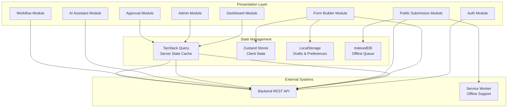

# Software Requirements Specification (SRS)
## Form Management System - Frontend Application

**Document Version:** 2.0  
**Date:** January 2026  
**Project:** form-frontend  
**Technology Stack:** Next.js, React, TypeScript, Tailwind CSS

---

## Table of Contents

1. [Introduction](#1-introduction)
2. [System Overview](#2-system-overview)
3. [User Roles & Interfaces](#3-user-roles--interfaces)
4. [Functional Requirements](#4-functional-requirements)
5. [Non-Functional Requirements](#5-non-functional-requirements)
6. [UI Component Architecture](#6-ui-component-architecture)
7. [State Management Strategy](#7-state-management-strategy)
8. [Security & Performance](#8-security--performance)
9. [Integration Requirements](#9-integration-requirements)
10. [Data Models & Type Definitions](#10-data-models--type-definitions)
11. [API Endpoints Reference](#11-api-endpoints-reference)
12. [Validation Specifications](#12-validation-specifications)
13. [Error Handling Strategy](#13-error-handling-strategy)
14. [Testing Requirements](#14-testing-requirements)

**Appendices:**
- [Appendix A: UI Specifications & User Flows](./FRONTEND_SRS_APPENDIX_A.md)
- [Appendix B: Environment Configuration](./FRONTEND_SRS_APPENDIX_B.md)
- [Appendix C: Deployment & Operations](./FRONTEND_SRS_APPENDIX_C.md)
- [Appendix D: Accessibility Guidelines](./FRONTEND_SRS_APPENDIX_D.md)
- [Appendix E: Performance Optimization](./FRONTEND_SRS_APPENDIX_E.md)

---

## 1. Introduction

### 1.1 Purpose
This document defines the complete Software Requirements Specification for the **Form Management System Frontend**. The application serves as the user interface for all system stakeholders, offering responsive, accessible, and high-performance tools for creating forms, managing data, submitting responses, and leveraging advanced features like AI generation and external system integrations.

### 1.2 Scope
The Frontend Application enables:
- **Form Creation**: A rich drag-and-drop builder with AI assistance
- **Form Management**: Comprehensive dashboard for lifecycle management
- **Public Access**: High-performance, PWA-capable submission pages
- **Data Analysis**: Advanced visualization and filtering tools
- **Administration**: Role-based views for users, workflows, and system config
- **Integrations**: UI for eHospital (UHID), SMS OTP, and workflow automation
- **Approval Workflows**: Multi-step approval process management

### 1.3 Intended Audience
- Frontend Developers (React/Next.js)
- UI/UX Designers
- QA Engineers
- Backend Developers (API contract verification)
- Project Managers
- DevOps Engineers

### 1.4 Technology Stack
| Component | Technology | Version | Rationale |
|-----------|------------|---------|-----------|
| **Framework** | Next.js | 14+ | App Router, SSR, ISR capabilities |
| **Language** | TypeScript | 5+ | Type safety, developer experience |
| **Styling** | Tailwind CSS | 3+ | Utility-first, maintainable |
| **UI Library** | Shadcn UI | Latest | Accessible Radix primitives |
| **State (Server)** | TanStack Query | 5+ | Caching, optimistic updates |
| **State (Client)** | Zustand | 4+ | Lightweight global state |
| **Form Logic** | React Hook Form | 7+ | Performance, validation |
| **Validation** | Zod | 3+ | Schema-based validation |
| **Drag & Drop** | Dnd Kit | 6+ | Accessible DnD primitives |
| **Charts** | Recharts | 2+ | Composable visualizations |
| **Icons** | Lucide React | Latest | Consistent iconography |
| **Testing** | Vitest + Playwright | Latest | Unit & E2E testing |
| **PWA** | next-pwa | 5+ | Service worker generation |

---

## 2. System Overview

### 2.1 Application Architecture



### 2.2 Key Features by Module

| Module | Features | Backend Integration |
|--------|----------|---------------------|
| **Authentication** | Login, Register, OTP, Session Management | FR-AUTH-001 to FR-AUTH-005 |
| **Dashboard** | Stats, Form List, Recent Activity, Tasks | FR-DASH-001, FR-DASH-002 |
| **Form Builder** | Drag-Drop, Properties, Logic, AI Gen, Versioning | FR-FORM-001 to FR-FORM-014 |
| **Public Submission** | Form Rendering, Validation, File Upload, Integrations | FR-RESP-001, FR-RESP-002 |
| **Response Management** | Data Grid, Filters, Export, Detail View | FR-RESP-003 to FR-RESP-013 |
| **Approval Workflow** | Timeline, Approve/Reject, Comments, History | FR-APPROVAL-* |
| **Analytics** | Charts, Trends, AI Insights | FR-ANALYTICS-001, FR-ANALYTICS-002 |
| **Workflows** | Visual Editor, Triggers, Actions | FR-WORK-001, FR-WORK-002 |
| **AI Assistant** | Form Generation, Smart Suggestions, Analysis | FR-AI-* |

---

## 3. User Roles & Interfaces

### 3.1 Role-Based Access Matrix

| User Role | Access Level | Primary Views | Key Capabilities |
|-----------|--------------|---------------|------------------|
| **Superadmin** | Full System | All modules | System config, user management, all forms |
| **Admin** | Administrative | Dashboard, Admin Panel, All Forms | User management, workflow config |
| **Creator** | Content Creation | Dashboard, Builder, Responses | Create/edit own forms, AI generation |
| **Editor** | Content Editing | Dashboard, Builder (assigned) | Edit assigned forms, view responses |
| **Publisher** | Publishing | Dashboard, Form List | Publish/unpublish forms |
| **Manager** | Approval & Review | Dashboard, Responses, Approvals | Approve/reject submissions |
| **DEO** | Data Entry | Public Submission (authenticated) | Submit form responses |
| **User** | Basic | Dashboard (limited), Submission | Submit to assigned forms |
| **Respondent** | Public | Public Submission Pages | Submit to public forms |

### 3.2 Navigation Structure

**Global (Unauthenticated):**
- `/` - Landing Page
- `/login` - Login Page (Email/Password or OTP)
- `/register` - Registration Page
- `/forgot-password` - Password Reset
- `/submit/[slug]` - Public Form Submission

**Private Dashboard Layout:**
```
├── Sidebar
│   ├── 🏠 Dashboard (Home)
│   ├── 📋 My Forms
│   ├── 📊 Responses
│   ├── ✅ Approvals (if Manager role)
│   ├── 🔄 Workflows (if Admin role)
│   ├── 🤖 AI Assistant
│   └── ⚙️ Settings
├── Header
│   ├── Global Search
│   ├── Notifications (🔔)
│   ├── Theme Toggle (🌙)
│   └── User Menu
└── Content Area
```

**Form Builder Layout (Isolated):**
```
├── Header
│   ├── Form Title (editable)
│   ├── Save Status Indicator
│   ├── Preview Toggle
│   ├── Version Dropdown
│   ├── Publish Button
│   └── AI Assistant Toggle
├── Left Sidebar - Component Library
│   ├── Basic Fields (Input, Textarea, Number)
│   ├── Choice Fields (Select, Radio, Checkbox)
│   ├── Advanced (Date, Rating, File)
│   ├── Integration (UHID, OTP)
│   └── Layout (Section, Divider)
├── Canvas (Center) - Working Area
└── Right Sidebar - Properties Panel
    ├── Field Settings
    ├── Validation Rules
    ├── Conditional Logic
    └── Advanced Options
```

---

**[Continue to Part 2 with Sections 4-7...]**

*This document is split into multiple files for maintainability. See linked appendices for detailed specifications.*
