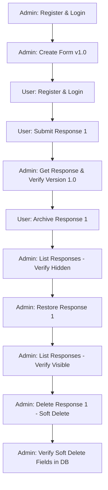
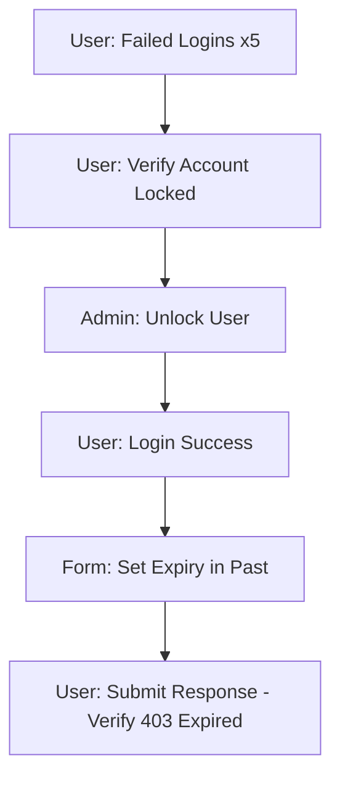
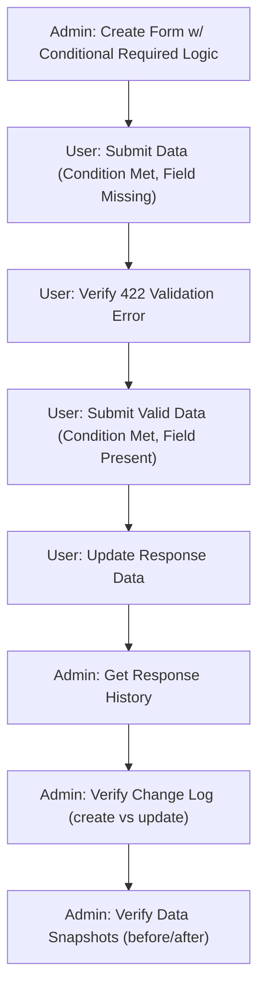
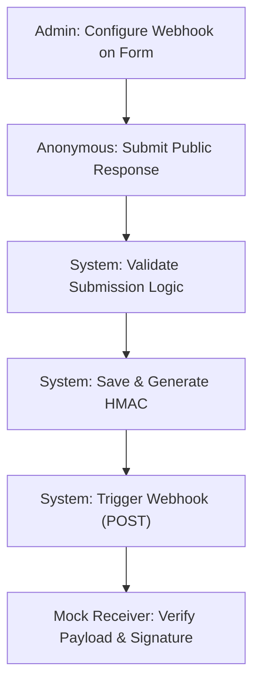

# Integration Test Flow

This document defines the end-to-end integration testing flow for the Form Management System.

## Flow 1: Complete Form Management Life Cycle

## Flow 2: Form Hardening & Security

## Flow 3: Permission Matrix

| User Role | Action: View Form | Action: Edit Form | Action: Submit |
|-----------|-------------------|-------------------|----------------|
| Creator   | ✅ Pass            | ✅ Pass            | ✅ Pass         |
| Editor    | ✅ Pass            | ✅ Pass            | ✅ Pass         |
| Viewer    | ✅ Pass            | ❌ Forbidden      | ❌ Forbidden    |
| Anonymous | ❌ Forbidden*     | ❌ Forbidden      | ❌ Forbidden/✅ Public |

*\* Viewer restricted to forms they are assigned or public forms.*

## Flow 4: Advanced Logic & History

## Flow 5: Webhook & Public Access

## Implementation Status

- [x] **Core Registration/Login**: Verified in [test_auth.py](file:///home/programmer/Desktop/form-frontend/backend/tests/test_auth.py)
- [x] **Basic Submission**: Verified in [test_responses.py](file:///home/programmer/Desktop/form-frontend/backend/tests/test_responses.py)
- [x] **Draft Blocking**: Verified in [test_responses.py](file:///home/programmer/Desktop/form-frontend/backend/tests/test_responses.py)
- [x] **Response Versioning**: Verified in [test_integration_flow.py](file:///home/programmer/Desktop/form-frontend/backend/tests/test_integration_flow.py)
- [x] **Soft Delete Consistency**: Verified in [test_integration_flow.py](file:///home/programmer/Desktop/form-frontend/backend/tests/test_integration_flow.py)
- [x] **Restore Response**: Verified in [test_integration_flow.py](file:///home/programmer/Desktop/form-frontend/backend/tests/test_integration_flow.py)
- [x] **Filtering of Deleted**: Verified in [test_integration_flow.py](file:///home/programmer/Desktop/form-frontend/backend/tests/test_integration_flow.py)
- [x] **Account Lockout Flow**: Verified in [test_integration_flow.py](file:///home/programmer/Desktop/form-frontend/backend/tests/test_integration_flow.py)
- [x] **Conditional Logic**: Verified in [test_advanced_features.py](file:///home/programmer/Desktop/form-frontend/backend/tests/test_advanced_features.py)
- [x] **Response History**: Verified in [test_advanced_features.py](file:///home/programmer/Desktop/form-frontend/backend/tests/test_advanced_features.py)
- [x] **Webhook Triggers**: Verified in [test_advanced_features.py](file:///home/programmer/Desktop/form-frontend/backend/tests/test_advanced_features.py)
- [x] **Public Form Validation**: Verified in [test_advanced_features.py](file:///home/programmer/Desktop/form-frontend/backend/tests/test_advanced_features.py)
