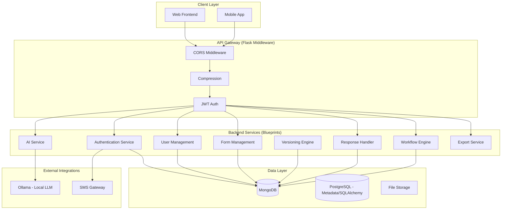
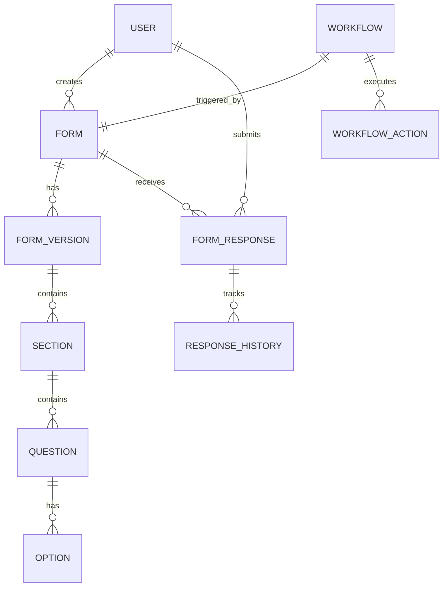
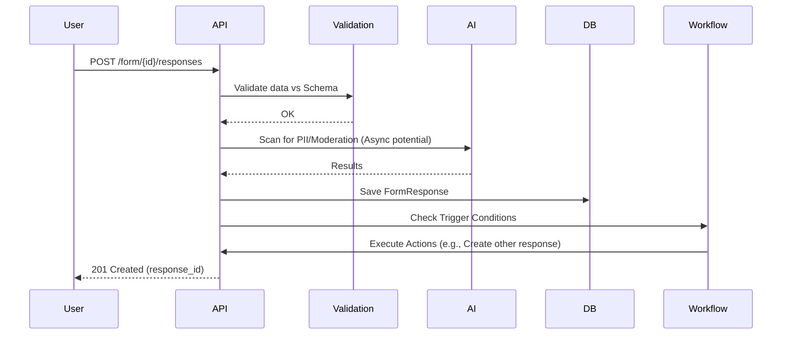

# Architecture & Diagrams

## 1. As-Is System Architecture

## 2. Entity Relationship Diagram (ERD)

## 3. Data Flow Diagram (DFD) - Submission Flow

## 4. To-Be Improvements

- **Microservices Path**: Decouple AI and Export services into separate containers for scaling.
- **Event-Driven**: Use a message queue (RabbitMQ/Redis) for Workflows and AI tasks.
- **Enhanced Caching**: Implement Redis for frequently accessed form definitions.
