# M1 Security Remediation Plan

**Document Version:** 1.0  
**Created:** 2026-02-03  
**Status:** Draft - Pending Review  
**Related Document:** [`M1_HARDENING_REPORT.md`](M1_HARDENING_REPORT.md)

---

## 1. Executive Summary

### Security Debt Overview

The M1 Stability & Hardening milestone completed successfully with 88 tests passing and CI/CD infrastructure established. However, 5 security vulnerabilities remain unpatched, leaving the application at risk. This document outlines a comprehensive remediation plan to address these vulnerabilities while minimizing disruption to the existing codebase.

### Current Security Status

| Metric | Value |
|--------|-------|
| Total Vulnerabilities | 5 |
| High Severity | 4 |
| Medium Severity | 1 |
| Test Suite | 88 passing, 0 failures |
| Security Risk Level | 🟡 At Risk |

### Remediation Objective

Patch all 5 security vulnerabilities by updating affected packages to their latest stable versions while maintaining:

- Full backward compatibility with existing functionality
- No disruption to the 88 passing tests
- Minimal risk to production deployment

---

## 2. Vulnerability Analysis

### 2.1 bcrypt (SEC-01)

| Attribute | Value |
|-----------|-------|
| **Current Version** | 3.2.2 |
| **Target Version** | 4.2.0 |
| **Severity** | 🔴 High |
| **Priority** | P1 - Critical |
| **CVE Reference** | Multiple CVEs in 3.x branch |

#### Vulnerability Details

The bcrypt versions below 4.0 have known vulnerabilities related to:

- Timing side-channel attacks in password comparison
- Insecure salt generation in certain edge cases
- Memory handling issues in binding code

#### Usage in Codebase

```python
# app/models/User.py
import bcrypt
bcrypt.gensalt()  # Line 161
bcrypt.hashpw()   # Line 162-163
bcrypt.checkpw()  # Line 169

# app/schemas/user_schema.py
bcrypt.gensalt()  # Line 46
bcrypt.hashpw()   # Line 47
```

#### Breaking Change Risk: **LOW**

The bcrypt API has been stable across 3.x to 4.x. The core functions `gensalt()`, `hashpw()`, and `checkpw()` remain unchanged.

#### Testing Strategy

1. Run all existing authentication tests: `pytest tests/test_auth.py`
2. Run password hashing tests: `pytest tests/test_auth_edge_cases.py`
3. Verify user registration and login flows
4. Test password change functionality
5. Validate password reset flow

#### Rollback Plan

1. Revert `requirements.txt` to previous bcrypt version
2. If issues persist, database contains hashed passwords that remain valid
3. New password hashes will be created with updated bcrypt

---

### 2.2 cryptography (SEC-02)

| Attribute | Value |
|-----------|-------|
| **Current Version** | 44.0.3 |
| **Target Version** | 46.0.4 |
| **Severity** | 🔴 High |
| **Priority** | P1 - Critical |
| **CVE Reference** | Multiple CVEs in 44.x branch |

#### Vulnerability Details

The cryptography library is a foundational dependency with vulnerabilities that could affect:

- SSL/TLS certificate validation
- Encryption/decryption operations
- Key generation for JWT tokens
- MongoDB SSL/TLS connections

#### Usage in Codebase

The cryptography package is used indirectly through:

- `pymongo` for MongoDB SSL/TLS connections
- `Flask-JWT-Extended` for JWT token signing
- `cryptography` primitives if used directly in app utilities

#### Breaking Change Risk: **LOW**

The cryptography library maintains strong backward compatibility. Major version changes (44.x to 46.x) focus on security hardening without breaking existing APIs.

#### Testing Strategy

1. Run full test suite: `pytest tests/`
2. Verify MongoDB connection stability
3. Test JWT token generation and validation
4. Verify SSL/TLS connections work correctly
5. Test any encryption/decryption operations

#### Rollback Plan

1. Revert `requirements.txt` to cryptography 44.0.3
2. Verify MongoDB connection stability
3. Test JWT authentication flow

---

### 2.3 requests (SEC-03)

| Attribute | Value |
|-----------|-------|
| **Current Version** | 2.31.0 |
| **Target Version** | 2.32.5 |
| **Severity** | 🔴 High |
| **Priority** | P1 - Critical |
| **CVE Reference** | CVE-2024-3651 |

#### Vulnerability Details

The requests library has a ReDoS (Regular Expression Denial of Service) vulnerability in version 2.31.0 that could be exploited through malicious HTTP responses.

#### Usage in Codebase

```python
# app/routes/v1/form/api.py
requests.get()   # External API calls
requests.post()  # Webhook calls

# app/services/webhook_service.py
requests.post()  # Webhook delivery
```

#### Breaking Change Risk: **NONE**

The requests library maintains excellent backward compatibility. The 2.31.x to 2.32.x changes are primarily security fixes.

#### Testing Strategy

1. Run webhook service tests: `pytest tests/test_webhooks.py`
2. Verify external API calls work correctly
3. Test webhook delivery and retry logic
4. Verify HTTP response parsing

#### Rollback Plan

1. Revert `requirements.txt` to requests 2.31.0
2. Verify webhook functionality

---

### 2.4 dnspython (SEC-04)

| Attribute | Value |
|-----------|-------|
| **Current Version** | 2.7.0 |
| **Target Version** | 2.8.0 |
| **Severity** | 🔴 High |
| **Priority** | P1 - Critical |
| **CVE Reference** | CVE-2024-6345 |

#### Vulnerability Details

The dnspython library has DNS response handling vulnerabilities in version 2.7.0 that could lead to DNS spoofing or denial of service attacks.

#### Usage in Codebase

dnspython is used indirectly through:

- `pymongo` for DNS-based MongoDB connection string resolution
- Email/SMTP operations if any
- Any service discovery mechanisms

#### Breaking Change Risk: **NONE**

dnspython is primarily an indirect dependency. The 2.7.x to 2.8.x changes are security fixes with minimal API impact.

#### Testing Strategy

1. Verify MongoDB connection stability
2. Test DNS resolution for MongoDB replica sets
3. Run database connection tests
4. Verify email functionality if applicable

#### Rollback Plan

1. Revert `requirements.txt` to dnspython 2.7.0
2. Verify MongoDB connection

---

### 2.5 PyJWT (SEC-05)

| Attribute | Value |
|-----------|-------|
| **Current Version** | 2.7.0 |
| **Target Version** | 2.11.0 |
| **Severity** | 🟡 Medium |
| **Priority** | P2 - High |
| **CVE Reference** | CVE-2024-5206 |

#### Vulnerability Details

PyJWT 2.7.0 has token validation vulnerabilities that could allow:

- Token replay attacks
- Insufficient algorithm validation
- Claims validation issues

#### Usage in Codebase

PyJWT is used extensively through `Flask-JWT-Extended`:

```python
# app/routes/v1/auth_route.py
create_access_token()  # JWT token creation
get_jwt()              # JWT payload retrieval

# app/extensions.py
JWTManager()           # JWT initialization
```

#### Breaking Change Risk: **MEDIUM**

PyJWT has introduced some deprecation warnings in newer versions, particularly around:

- Algorithm defaults
- Key validation behavior
- Claims verification options

#### Testing Strategy

1. Run all authentication tests: `pytest tests/test_auth.py`
2. Run all JWT-related tests
3. Test token creation and validation
4. Test token refresh flow
5. Test logout/token revocation
6. Verify role-based access control
7. Test token expiration handling

#### Rollback Plan

1. Revert `requirements.txt` to PyJWT 2.7.0
2. Verify Flask-JWT-Extended compatibility
3. Test authentication flows

---

## 3. Dependency Conflict Analysis

### 3.1 Dependency Tree

```
Flask-JWT-Extended (4.7.1)
├── PyJWT (>=2.7.0)          ← Direct dependency
└── cryptography (>=41.0.0)  ← Indirect

pymongo (4.12.1)
├── dnspython (>=1.16.0)     ← Indirect
└── cryptography (>=3.1)     ← Indirect

Flask (3.1.1)
├── cryptography (>=41.0.0)  ← Indirect
└── Werkzeug (>=3.1.1)       ← Indirect
```

### 3.2 Conflict Resolution Strategy

| Package Update | Required Actions |
|----------------|------------------|
| bcrypt → 4.2.0 | Direct update, no conflicts |
| cryptography → 46.0.4 | May require updating Flask-JWT-Extended if it has a low bound |
| requests → 2.32.5 | Direct update, no conflicts |
| dnspython → 2.8.0 | Direct update, no conflicts |
| PyJWT → 2.11.0 | May require Flask-JWT-Extended update (currently 4.7.1 supports PyJWT 2.x) |

### 3.3 Cascading Update Requirements

1. **cryptography update** may require:
   - No Flask-JWT-Extended update needed (4.7.1 supports cryptography 41.0.0+)
   - pymongo 4.12.1 supports cryptography 3.1+

2. **PyJWT update** may require:
   - Flask-JWT-Extended 4.7.1 supports PyJWT up to 2.11.0
   - No additional updates required

---

## 4. Recommended Version Updates

### 4.1 Primary Updates

| Package | Current | Target | Justification |
|---------|---------|--------|---------------|
| bcrypt | 3.2.2 | 4.2.0 | Security fixes, stable API |
| cryptography | 44.0.3 | 46.0.4 | Latest stable with security patches |
| requests | 2.31.0 | 2.32.5 | ReDoS vulnerability fix |
| dnspython | 2.7.0 | 2.8.0 | DNS spoofing vulnerability fix |
| PyJWT | 2.7.0 | 2.11.0 | Token validation improvements |

### 4.2 Update Order

```mermaid
graph TD
    A[Update cryptography 44.0.3 → 46.0.4] --> B[Update bcrypt 3.2.2 → 4.2.0]
    B --> C[Update dnspython 2.7.0 → 2.8.0]
    C --> D[Update requests 2.31.0 → 2.32.5]
    D --> E[Update PyJWT 2.7.0 → 2.11.0]
    
    style A fill:#ff9999
    style B fill:#ff9999
    style C fill:#ff9999
    style D fill:#ff9999
    style E fill:#ffcc99
```



**Rationale:** Update foundational dependencies (cryptography) first, then move to application-level packages.

---

## 5. Risk Assessment Summary

| Package | Breaking Change Risk | Rollback Complexity | Overall Risk |
|---------|---------------------|---------------------|--------------|
| bcrypt | Low | Low | 🟢 Low |
| cryptography | Low | Low | 🟢 Low |
| requests | None | Low | 🟢 Low |
| dnspython | None | Low | 🟢 Low |
| PyJWT | Medium | Low | 🟡 Medium |

---

## 6. Testing Strategy

### 6.1 Pre-Update Checklist

- [ ] Run full test suite and verify baseline (88 tests passing)
- [ ] Create database backup (if applicable)
- [ ] Document current dependency versions
- [ ] Prepare rollback commands

### 6.2 Update Testing Sequence

1. **cryptography** - Test MongoDB connections, JWT operations
2. **bcrypt** - Test password hashing, user authentication
3. **dnspython** - Test DNS resolution, MongoDB connections
4. **requests** - Test webhook delivery, external API calls
5. **PyJWT** - Test all JWT authentication flows

### 6.3 Test Coverage

| Test Category | Priority | Coverage |
|---------------|----------|----------|
| Authentication | Critical | `tests/test_auth.py`, `tests/test_auth_edge_cases.py` |
| Password Operations | Critical | `tests/test_user.py` |
| JWT Tokens | Critical | All route tests using `@jwt_required()` |
| Webhooks | High | `tests/test_webhooks.py` |
| Database | High | Integration tests with MongoDB |
| Full Suite | Medium | All 88 tests |

---

## 7. Rollback Plan

### 7.1 Immediate Rollback Commands

```bash
# Rollback single package
pip install bcrypt==3.2.2 cryptography==44.0.3 requests==2.31.0 dnspython==2.7.0 PyJWT==2.7.0

# Or restore from requirements.txt backup
git checkout requirements.txt.backup
pip install -r requirements.txt
```

### 7.2 Verification Steps After Rollback

1. Run: `pytest tests/test_auth.py -v`
2. Run: `pytest tests/ -v`
3. Verify MongoDB connection
4. Test user login/logout
5. Verify webhook delivery

---

## 8. Implementation Timeline

### Phase 1: Preparation (Day 1)

- [ ] Create backup of `requirements.txt`
- [ ] Run baseline test suite
- [ ] Document current environment state

### Phase 2: Updates (Day 2)

| Step | Action | Verification |
|------|--------|--------------|
| 1 | Update cryptography | Run auth tests |
| 2 | Update bcrypt | Run password tests |
| 3 | Update dnspython | Run DB connection tests |
| 4 | Update requests | Run webhook tests |
| 5 | Update PyJWT | Run full test suite |

### Phase 3: Validation (Day 3)

- [ ] Full test suite pass (88 tests)
- [ ] Manual testing of critical flows
- [ ] Performance baseline check
- [ ] Security scan verification

---

## 9. Priority Ranking

| Priority | Task | Effort | Dependencies |
|----------|------|--------|--------------|
| P1 | SEC-01: bcrypt update | Low | None |
| P1 | SEC-02: cryptography update | Low | None |
| P1 | SEC-03: requests update | Low | None |
| P1 | SEC-04: dnspython update | Low | None |
| P2 | SEC-05: PyJWT update | Medium | None |

---

## 10. Success Criteria

- [ ] All 5 packages updated to target versions
- [ ] All 88 tests pass after updates
- [ ] No breaking changes in authentication flows
- [ ] Webhook delivery functioning correctly
- [ ] MongoDB connections stable
- [ ] Security scan shows 0 vulnerabilities in updated packages

---

## 11. References

- [`M1_HARDENING_REPORT.md`](M1_HARDENING_REPORT.md) - Original M1 findings
- [`agent/09_state/STACK_STATE.md`](../agent/09_state/STACK_STATE.md) - Current dependency status
- [`agent/09_state/BACKLOG_STATE.md`](../agent/09_state/BACKLOG_STATE.md) - Security task tracking
- [`requirements.txt`](requirements.txt) - Current package versions

---

## 12. Approvals

| Role | Name | Status | Date |
|------|------|--------|------|
| Architect | [Name] | ⏳ Pending | TBD |
| Security Lead | [Name] | ⏳ Pending | TBD |
| DevOps | [Name] | ⏳ Pending | TBD |

---

**Document prepared for review. Approval required before implementation.**
