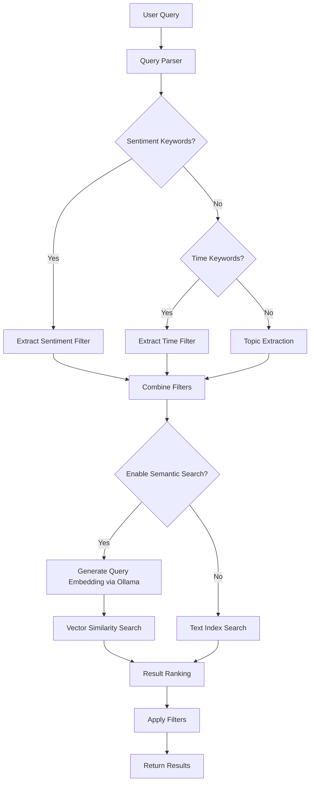

# Feature Specification: NLP Search Enhancement

## 1. Context & Goal

- **Task ID**: T-M2-02
- **Parent Requirement**: M2 - AI-Driven Intelligence
- **Objective**: Enable users to perform natural language searches across form responses using semantic understanding powered by Ollama LLM. Users should be able to ask queries like "Show me all users who were unhappy with delivery" and get relevant results without needing to construct complex database queries.

## 2. Technical Design

### 2.1 New Files

- `app/services/nlp_service.py` - NLP processing service for query parsing and semantic search
- `app/routes/v1/form/nlp_search.py` - New blueprint for enhanced NLP search endpoints
- `app/models/search_cache.py` - Cache model for search query results

### 2.2 Modified Files

- `app/routes/v1/form/ai.py` - Extend existing search endpoint with Ollama integration
- `app/config.py` - Add NLP configuration variables

### 2.3 Dependencies

- **Ollama Integration**: Uses local Ollama instance for semantic embedding generation
- **MongoDB Text Indexes**: Leverages existing MongoDB text indexes for keyword search
- **Redis** (optional): For caching search results

## 3. Data Model Changes

### 3.1 Search Cache Schema

```python
class SearchCache(Document):
    query_hash = StringField(required=True, unique=True)
    form_id = ObjectIdField()
    query_text = StringField()
    results_count = IntField()
    results_sample = ListField(DictField())
    created_at = DateTimeField(default=datetime.utcnow)
    expires_at = DateTimeField()
```

### 3.2 Form Response Enhancements

No schema changes required. Leverages existing `ai_results` field for sentiment data.

### 3.3 MongoDB Indexes

```javascript
// Text index on response data for keyword search
db.formresponses.createIndex(
    { "data": "text" },
    { weights: { "data": 1 } }
)

// Index on sentiment for filtering
db.formresponses.createIndex({ "ai_results.sentiment.label": 1 })
```

## 4. API Contracts

### 4.1 Enhanced Natural Language Search

**Endpoint**: `POST /api/v1/ai/forms/<form_id>/nlp-search`

**Request Payload**:

```json
{
  "query": "Show me all users who were unhappy with delivery",
  "options": {
    "max_results": 50,
    "include_sentiment": true,
    "semantic_search": true,
    "cache_results": true
  }
}
```

**Success Response**:

```json
{
  "query": "Show me all users who were unhappy with delivery",
  "parsed_intent": {
    "sentiment_filter": "negative",
    "topic": "delivery",
    "entities": ["delivery", "users"]
  },
  "results_count": 15,
  "results": [
    {
      "response_id": "resp_123",
      "data": {
        "section_main": {
          "q_satisfaction": "The delivery was terrible and arrived late"
        }
      },
      "sentiment": {
        "label": "negative",
        "score": -3
      },
      "relevance_score": 0.92
    }
  ],
  "processing_time_ms": 245,
  "cached": false
}
```

### 4.2 Semantic Search with Ollama

**Endpoint**: `POST /api/v1/ai/forms/<form_id>/semantic-search`

**Request Payload**:

```json
{
  "query": "What are the main complaints about product quality?",
  "similarity_threshold": 0.7,
  "max_results": 20
}
```

**Success Response**:

```json
{
  "query": "What are the main complaints about product quality?",
  "embedding_model": "nomic-embed-text",
  "results_count": 8,
  "results": [
    {
      "response_id": "resp_456",
      "data": {...},
      "similarity_score": 0.85,
      "highlighted_text": "...product <mark>quality</mark> was poor and items were damaged..."
    }
  ]
}
```

### 4.3 Query Types Supported

| Query Type | Example | Parsed Intent |
|------------|---------|---------------|
| Sentiment-based | "unhappy customers", "positive feedback" | sentiment: negative/positive |
| Topic-based | "complaints about delivery", "praise for support" | topic: delivery, support |
| Pattern-based | "responses over 5 minutes", "submitted after March" | pattern: time-based filter |
| Comparative | "compare satisfaction between Q1 and Q2" | cross-form analysis |
| Aggregate | "what percentage were negative" | aggregation query |

## 5. Query Processing Pipeline



## 6. Ollama Integration

### 6.1 Embedding Model Configuration

```python
# config.py
class Config:
    NLP_EMBEDDING_MODEL = "nomic-embed-text"  # or "mxbai-embed-large"
    NLP_EMBEDDING_URL = "http://localhost:11434/api/embeddings"
```

### 6.2 Embedding Generation

```python
def generate_query_embedding(query: str) -> List[float]:
    """Generate semantic embedding for search query using Ollama."""
    payload = {
        "model": current_app.config["NLP_EMBEDDING_MODEL"],
        "prompt": query
    }
    response = requests.post(
        current_app.config["NLP_EMBEDDING_URL"],
        json=payload
    )
    return response.json()["embedding"]
```

## 7. Acceptance Criteria

- [ ] User can search using natural language queries
- [ ] Sentiment-based queries (e.g., "unhappy users") correctly filter by sentiment
- [ ] Topic-based queries work with existing text index
- [ ] Semantic search uses Ollama embeddings for semantic matching
- [ ] Query results include relevance scores
- [ ] Search results are cached for repeated queries
- [ ] Performance: Search completes within 500ms for <1000 responses
- [ ] Authorization: Users can only search forms they have access to
- [ ] Fallback: Degrades gracefully if Ollama is unavailable

## 8. Testing Strategy

- **Unit Tests** (`tests/unit/test_nlp_search.py`):
  - Query parsing for sentiment keywords
  - Topic extraction from queries
  - Filter combination logic

- **Integration Tests** (`tests/integration/test_nlp_search.py`):
  - End-to-end search with Ollama
  - Caching behavior
  - Authorization checks

- **Performance Tests**:
  - Search response time with 1000+ responses
  - Concurrent search requests

## 9. Rollback Plan

1. Remove new endpoints from `ai.py`
2. Delete `nlp_service.py` and `nlp_search.py`
3. Revert `config.py` to remove NLP configuration
4. Drop `search_cache` MongoDB collection

## 10. Security Considerations

- **Input Validation**: Sanitize natural language queries to prevent injection
- **Authorization**: Verify form access before executing search
- **Rate Limiting**: Implement rate limiting to prevent search abuse
- **Data Exposure**: Ensure search results only include authorized response data
