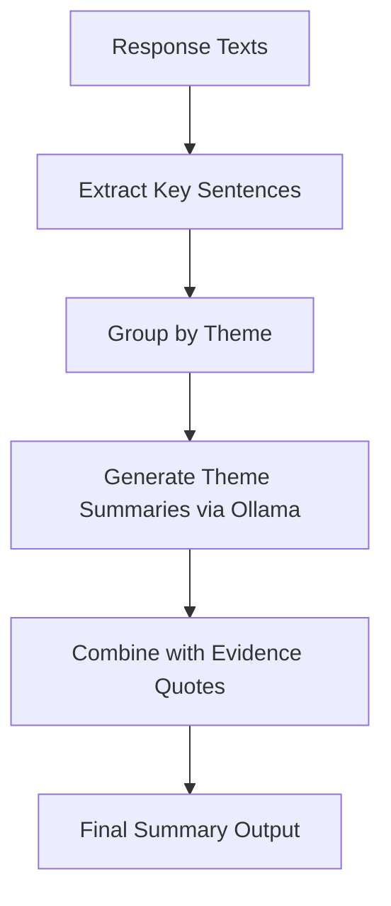

# Feature Specification: Automated Summarization

## 1. Context & Goal

- **Task ID**: T-M2-03
- **Parent Requirement**: M2 - AI-Driven Intelligence
- **Objective**: Provide API endpoints to automatically summarize hundreds of form feedback responses into concise, actionable insights. Users should be able to generate summaries in various formats (bullet points, paragraphs, key themes) with configurable length and focus areas.

## 2. Technical Design

### 2.1 New Files

- `app/services/summarization_service.py` - Core summarization logic with multiple strategies
- `app/routes/v1/form/summarization.py` - Blueprint for summarization endpoints
- `app/models/summary_cache.py` - Cache model for generated summaries

### 2.2 Modified Files

- `app/routes/v1/form/ai.py` - Enhance existing `/summarize` endpoint
- `app/config.py` - Add summarization configuration

### 2.3 Dependencies

- **Ollama Integration**: Uses Ollama for LLM-based abstractive summarization
- **MongoDB**: For storing summary history and cached results
- **Redis** (optional): For TTL-based caching

## 3. Data Model Changes

### 3.1 Summary Cache Schema

```python
class SummaryCache(Document):
    form_id = ObjectIdField(required=True)
    response_subset_hash = StringField(required=True)
    summary_type = StringField(required=True)  # bullet_points, themes, executive
    config = DictField()  # {max_length, focus_area, include_sentiment}
    summary_content = DictField()
    created_at = DateTimeField(default=datetime.utcnow)
    expires_at = DateTimeField()
    
    meta = {
        "indexes": [
            "form_id",
            "response_subset_hash",
            ("form_id", "summary_type")
        ]
    }
```

### 3.2 Summary History Schema

```python
class SummaryHistory(Document):
    form_id = ObjectIdField(required=True)
    user_id = ObjectIdField(required=True)
    summary_type = StringField()
    response_count = IntField()
    summary_length = IntField()
    generated_at = DateTimeField(default=datetime.utcnow)
```

## 4. API Contracts

### 4.1 Generate Summary

**Endpoint**: `POST /api/v1/ai/forms/<form_id>/summarize`

**Request Payload**:

```json
{
  "response_ids": ["id1", "id2", "id3"],  // Optional - defaults to all responses
  "strategy": "extractive" | "abstractive" | "hybrid",
  "format": "bullet_points" | "paragraphs" | "themes",
  "config": {
    "max_points": 5,
    "max_length": 500,
    "focus_area": "all" | "sentiment" | "topics" | "action_items",
    "include_sentiment": true,
    "include_quotes": true
  }
}
```

**Success Response**:

```json
{
  "form_id": "form_123",
  "responses_analyzed": 150,
  "strategy_used": "hybrid",
  "summary": {
    "format": "bullet_points",
    "bullet_points": [
      {
        "point": "Majority of customers (65%) mentioned slow delivery times",
        "sentiment": "negative",
        "supporting_count": 98,
        "confidence": 0.85
      },
      {
        "point": "Product quality received positive feedback (40 mentions)",
        "sentiment": "positive",
        "supporting_count": 40,
        "confidence": 0.78
      },
      {
        "point": "Customer support praised for quick resolution (25 mentions)",
        "sentiment": "positive",
        "supporting_count": 25,
        "confidence": 0.72
      }
    ],
    "theme_analysis": {
      "delivery": { "sentiment": "negative", "mentions": 98 },
      "product_quality": { "sentiment": "positive", "mentions": 40 },
      "customer_support": { "sentiment": "positive", "mentions": 25 }
    }
  },
  "metadata": {
    "processing_time_ms": 1250,
    "model_used": "llama3.2",
    "cached": false
  }
}
```

### 4.2 Generate Executive Summary

**Endpoint**: `POST /api/v1/ai/forms/<form_id>/executive-summary`

**Request Payload**:

```json
{
  "response_ids": [],  // Optional
  "audience": "leadership" | "operations" | "product",
  "tone": "formal" | "concise",
  "include_metrics": true
}
```

**Success Response**:

```json
{
  "form_id": "form_123",
  "executive_summary": {
    "overview": "Based on 150 responses, customer sentiment is mixed with 55% negative, 30% positive, and 15% neutral feedback.",
    "key_findings": [
      "Delivery performance is the primary driver of negative sentiment",
      "Product quality consistently exceeds expectations",
      "Customer support interactions show high satisfaction"
    ],
    "recommendations": [
      "Prioritize delivery speed improvements",
      "Maintain current product quality standards",
      "Document support interaction best practices"
    ],
    "metrics": {
      "total_responses": 150,
      "avg_sentiment_score": -0.3,
      "response_rate": 78
    }
  },
  "generated_at": "2026-02-03T10:00:00Z"
}
```

### 4.3 Theme-Based Summarization

**Endpoint**: `POST /api/v1/ai/forms/<form_id>/theme-summary`

**Request Payload**:

```json
{
  "themes": ["delivery", "product", "support", "pricing"],
  "include_quote_examples": true,
  "sentiment_per_theme": true
}
```

**Success Response**:

```json
{
  "form_id": "form_123",
  "theme_summary": {
    "delivery": {
      "sentiment": "negative",
      "mention_count": 98,
      "summary": "Delivery issues dominate negative feedback, with 45% citing late arrivals and 20% reporting lost packages.",
      "quote_examples": [
        "Package took 2 weeks to arrive, very disappointed",
        "Order still shows as pending after 10 days"
      ]
    },
    "product": {
      "sentiment": "positive",
      "mention_count": 40,
      "summary": "Product quality receives consistent praise, particularly for durability and design.",
      "quote_examples": [
        "Love the build quality, feels very premium",
        "Exceeded my expectations for the price"
      ]
    }
  }
}
```

## 5. Summarization Strategies

### 5.1 Extractive Summarization

Uses TF-IDF and sentence scoring to extract most relevant sentences from responses.

```python
def extractive_summarize(texts: List[str], max_points: int = 5) -> List[str]:
    """Extract top sentences based on keyword relevance."""
    # Step 1: Tokenize and calculate word frequencies
    # Step 2: Score each sentence by keyword density
    # Step 3: Select top-scoring unique sentences
    # Step 4: Cluster by sentiment and select diverse representatives
```

### 5.2 Abstractive Summarization (Ollama)

Uses LLM to generate new summary sentences.

```python
def abstractive_summarize(texts: List[str], prompt_template: str) -> str:
    """Generate summary using Ollama LLM."""
    combined_text = " ".join(texts[:100])  # Limit context
    prompt = f"""
    Summarize the following feedback responses into {max_points} key points.
    Focus on: {focus_area}
    
    Feedback: {combined_text[:5000]}
    """
    response = requests.post(OLLAMA_API, json={
        "model": "llama3.2",
        "prompt": prompt
    })
    return response.json()["response"]
```

### 5.3 Hybrid Approach

Combines extractive (for supporting evidence) with abstractive (for insight generation).



## 6. Caching Strategy

### 6.1 Cache Key Generation

```python
def generate_cache_key(form_id, response_ids, strategy, config):
    """Generate unique cache key based on summary parameters."""
    subset_hash = hashlib.md5(
        "-".join(sorted(response_ids)).encode()
    ).hexdigest()
    config_hash = hashlib.md5(str(config).encode()).hexdigest()
    return f"summary:{form_id}:{subset_hash}:{strategy}:{config_hash}"
```

### 6.2 Cache TTL

| Summary Type | TTL |
|--------------|-----|
| Bullet Points | 1 hour |
| Executive Summary | 24 hours |
| Theme Summary | 12 hours |

## 7. Acceptance Criteria

- [ ] Users can generate summaries from any subset of responses
- [ ] Multiple summarization strategies are supported (extractive, abstractive, hybrid)
- [ ] Summary format is configurable (bullet points, themes, executive)
- [ ] Generated summaries include sentiment analysis
- [ ] Caching works correctly for repeated summary requests
- [ ] Performance: Summarization of 100 responses completes within 5 seconds
- [ ] Ollama integration provides high-quality abstractive summaries
- [ ] Authorization: Users can only summarize forms they have access to
- [ ] Graceful degradation when Ollama is unavailable

## 8. Testing Strategy

- **Unit Tests** (`tests/unit/test_summarization.py`):
  - Extractive summarization algorithm
  - Sentence scoring logic
  - Cache key generation

- **Integration Tests** (`tests/integration/test_summarization.py`):
  - End-to-end summary generation
  - Ollama API integration
  - Caching behavior
  - Authorization

- **Quality Tests**:
  - Summary quality evaluation (manual review)
  - Faithfulness to original responses

## 9. Rollback Plan

1. Remove summarization endpoints from `ai.py`
2. Delete `summarization_service.py` and `summarization.py`
3. Revert `config.py` to remove summarization configuration
4. Drop `summary_cache` and `summary_history` MongoDB collections

## 10. Security Considerations

- **Input Validation**: Validate response_ids belong to the specified form
- **Rate Limiting**: Prevent excessive summarization requests
- **Data Privacy**: Ensure cached summaries don't expose sensitive data
- **Content Safety**: Filter inappropriate content in summaries
