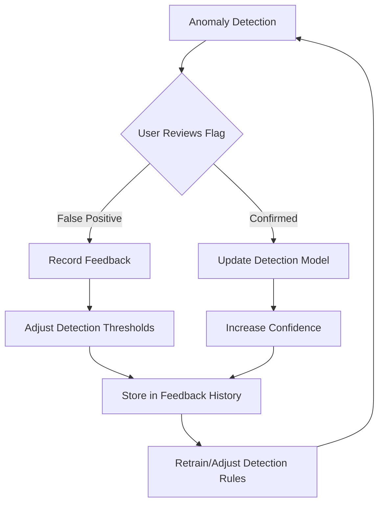

# Feature Specification: Predictive Anomaly Detection

## 1. Context & Goal

- **Task ID**: T-M2-04
- **Parent Requirement**: M2 - AI-Driven Intelligence
- **Objective**: Automatically detect and flag anomalous form responses including spam, statistical outliers, impossible values, and suspicious patterns. The system should provide a feedback loop for users to improve detection accuracy over time.

## 2. Technical Design

### 2.1 New Files

- `app/services/anomaly_detection_service.py` - Core detection algorithms
- `app/routes/v1/form/anomaly.py` - Blueprint for anomaly detection endpoints
- `app/models/anomaly_models.py` - Models for storing detection history and feedback

### 2.2 Modified Files

- `app/routes/v1/form/ai.py` - Enhance existing anomaly detection endpoints
- `app/models/Form.py` - Add anomaly_flags field to FormResponse

### 2.3 Dependencies

- **Statistical Libraries**: scipy, numpy for outlier detection
- **Ollama Integration**: For intelligent content analysis
- **MongoDB**: For storing anomaly detection results and feedback

## 3. Data Model Changes

### 3.1 Anomaly Flags Schema (Embedded in FormResponse)

```python
class AnomalyFlag(Document):
    response_id = ObjectIdField(required=True)
    form_id = ObjectIdField(required=True)
    
    flags = ListField(DictField())
    # Flag structure: {
    #   "type": "spam" | "outlier" | "impossible_value" | "duplicate" | "pattern",
    #   "confidence": float,
    #   "severity": "low" | "medium" | "high" | "critical",
    #   "description": str,
    #   "details": dict
    # }
    
    overall_score = FloatField()  # 0-100 spam probability
    is_reviewed = BooleanField(default=False)
    reviewed_by = ObjectIdField()
    reviewed_at = DateTimeField()
    user_feedback = StringField()  # "false_positive", "correct"
    
    detected_at = DateTimeField(default=datetime.utcnow)
    analyzed_at = DateTimeField(default=datetime.utcnow)
```

### 3.2 Anomaly Detection History Schema

```python
class AnomalyDetectionHistory(Document):
    form_id = ObjectIdField(required=True)
    scan_type = StringField()  # "full" | "incremental"
    responses_scanned = IntField()
    anomalies_detected = IntField()
    scan_duration_ms = IntField()
    baseline_stats = DictField()
    performed_by = ObjectIdField()
    performed_at = DateTimeField(default=datetime.utcnow)
```

### 3.3 Anomaly Feedback Schema

```python
class AnomalyFeedback(Document):
    flag_id = ObjectIdField(required=True)
    user_id = ObjectIdField(required=True)
    response_id = ObjectIdField(required=True)
    feedback_type = StringField()  # "confirm_anomaly", "false_positive"
    comment = StringField()
    created_at = DateTimeField(default=datetime.utcnow)
```

## 4. API Contracts

### 4.1 Run Anomaly Detection

**Endpoint**: `POST /api/v1/ai/forms/<form_id>/detect-anomalies`

**Request Payload**:

```json
{
  "scan_type": "full" | "incremental",
  "response_ids": ["id1", "id2"],  // Optional - for incremental
  "detection_types": ["spam", "outlier", "impossible_value", "duplicate", "pattern"],
  "sensitivity": "low" | "medium" | "high",
  "save_results": true
}
```

**Success Response**:

```json
{
  "form_id": "form_123",
  "scan_type": "full",
  "responses_scanned": 250,
  "anomalies_detected": 12,
  "scan_duration_ms": 850,
  "baseline": {
    "avg_response_length": 150,
    "std_response_length": 45,
    "avg_sentiment_score": 0.3,
    "std_sentiment_score": 1.2
  },
  "anomalies": [
    {
      "response_id": "resp_789",
      "overall_score": 75,
      "severity": "high",
      "flags": [
        {
          "type": "spam",
          "confidence": 0.85,
          "description": "Spam patterns detected",
          "details": {
            "spam_score": 75,
            "indicators": ["Contains spam keywords", "Suspiciously fast submission"]
          }
        }
      ],
      "response_preview": {
        "text_length": 25,
        "sentiment": "neutral",
        "submission_time_seconds": 1.5
      }
    }
  ],
  "summary_by_type": {
    "spam": 5,
    "outlier": 3,
    "duplicate": 2,
    "impossible_value": 1,
    "pattern": 1
  }
}
```

### 4.2 Get Anomaly Details

**Endpoint**: `GET /api/v1/ai/forms/<form_id>/anomalies/<response_id>`

**Success Response**:

```json
{
  "response_id": "resp_789",
  "anomaly_flags": {
    "spam": {
      "score": 75,
      "indicators": [
        {
          "name": "spam_keyword",
          "description": "Contains spam keywords",
          "weight": 20
        },
        {
          "name": "fast_submission",
          "description": "Submitted in under 2 seconds",
          "weight": 25
        }
      ],
      "confidence": 0.85
    },
    "duplicate": null,
    "outlier": null
  },
  "response_data": {...},
  "review_status": "pending",
  "suggested_actions": ["review", "flag_response", "ignore"]
}
```

### 4.3 Submit Feedback

**Endpoint**: `POST /api/v1/ai/forms/<form_id>/anomalies/<response_id>/feedback`

**Request Payload**:

```json
{
  "feedback_type": "false_positive" | "correct",
  "comment": "This is a legitimate response, not spam"
}
```

**Success Response**:

```json
{
  "message": "Feedback recorded successfully",
  "feedback_id": "fb_123",
  "model_improvement": "This feedback will help improve future detection accuracy"
}
```

### 4.4 Get Detection Statistics

**Endpoint**: `GET /api/v1/ai/forms/<form_id>/anomaly-stats`

**Success Response**:

```json
{
  "form_id": "form_123",
  "total_responses": 250,
  "flagged_count": 12,
  "flagged_percentage": 4.8,
  "reviewed_count": 8,
  "false_positive_rate": 0.15,
  "detection_accuracy": 0.92,
  "recent_scans": [
    {
      "scan_date": "2026-02-03",
      "anomalies_found": 3,
      "false_positives": 0
    }
  ]
}
```

## 5. Detection Methods

### 5.1 Spam Detection

```python
def detect_spam(response: FormResponse, baseline: Dict) -> Dict:
    """Detect spam-like patterns in responses."""
    spam_score = 0
    indicators = []
    
    # Content-based detection
    if contains_spam_keywords(response.text):
        spam_score += 30
        indicators.append("spam_keyword")
    
    # Pattern-based detection
    if is_all_caps(response.text, threshold=0.8):
        spam_score += 15
        indicators.append("all_caps")
    
    # Timing-based detection
    if response.submission_time < 2:
        spam_score += 25
        indicators.append("fast_submission")
    
    # Duplicate detection
    if is_duplicate(response, existing_responses):
        spam_score += 30
        indicators.append("duplicate")
    
    return {
        "spam_score": min(spam_score, 100),
        "indicators": indicators
    }
```

### 5.2 Statistical Outlier Detection

```python
def detect_outliers(responses: List[FormResponse], baseline: Dict) -> List[Dict]:
    """Detect statistical outliers using Z-score method."""
    outliers = []
    
    for resp in responses:
        z_scores = {}
        
        # Response length outlier
        length = len(resp.text)
        if baseline["std_response_length"] > 0:
            z_length = abs(length - baseline["avg_response_length"]) / baseline["std_response_length"]
            z_scores["length"] = z_length
        
        # Sentiment outlier
        if baseline["std_sentiment_score"] > 0:
            sentiment = resp.ai_results.get("sentiment", {}).get("score", 0)
            z_sentiment = abs(sentiment - baseline["avg_sentiment_score"]) / baseline["std_sentiment_score"]
            z_scores["sentiment"] = z_sentiment
        
        # Flag if any z-score exceeds threshold (default: 3)
        if any(z > 3 for z in z_scores.values()):
            outliers.append({
                "response_id": resp.id,
                "type": "outlier",
                "z_scores": z_scores,
                "confidence": min(max(z_scores.values()) / 5, 1.0)
            })
    
    return outliers
```

### 5.3 Impossible Value Detection

```python
def detect_impossible_values(response: FormResponse, form_schema: Dict) -> List[Dict]:
    """Detect values that are logically impossible based on field constraints."""
    impossibles = []
    
    for field_id, value in response.data.items():
        field_schema = get_field_schema(form_schema, field_id)
        
        if field_schema.type == "number":
            if "min" in field_schema.constraints and value < field_schema.constraints["min"]:
                impossibles.append({
                    "field": field_id,
                    "value": value,
                    "reason": f"Value below minimum ({field_schema.constraints['min']})"
                })
            if "max" in field_schema.constraints and value > field_schema.constraints["max"]:
                impossibles.append({
                    "field": field_id,
                    "value": value,
                    "reason": f"Value above maximum ({field_schema.constraints['max']})"
                })
        
        if field_schema.type == "date":
            if value > datetime.now():
                impossibles.append({
                    "field": field_id,
                    "value": value,
                    "reason": "Future date in response submitted today"
                })
    
    return impossibles
```

## 6. Feedback Loop



## 7. Acceptance Criteria

- [ ] System detects spam patterns with 90%+ accuracy
- [ ] Statistical outliers are identified using Z-score method
- [ ] Impossible values are caught based on field constraints
- [ ] Duplicate responses are flagged
- [ ] Detection sensitivity is configurable (low/medium/high)
- [ ] Users can submit feedback on flagged responses
- [ ] False positive rate is tracked and displayed
- [ ] Performance: Detection of 250 responses completes within 2 seconds
- [ ] Detection results are stored for historical analysis
- [ ] Authorization: Only form owners can view/review anomalies

## 8. Testing Strategy

- **Unit Tests** (`tests/unit/test_anomaly_detection.py`):
  - Spam detection algorithm
  - Z-score calculation
  - Impossible value validation

- **Integration Tests** (`tests/integration/test_anomaly_detection.py`):
  - End-to-end detection flow
  - Feedback submission
  - Statistics calculation

- **Detection Quality Tests**:
  - False positive rate calculation
  - Detection accuracy evaluation

## 9. Rollback Plan

1. Remove anomaly detection endpoints from `ai.py`
2. Delete `anomaly_detection_service.py` and `anomaly.py`
3. Remove `anomaly_flags` field from FormResponse schema
4. Drop anomaly-related MongoDB collections
5. Revert `config.py` to remove anomaly detection configuration

## 10. Security Considerations

- **False Positive Handling**: Ensure legitimate responses aren't incorrectly flagged
- **Feedback Privacy**: Feedback data should not expose flagged content to unauthorized users
- **Rate Limiting**: Prevent abuse of anomaly detection endpoints
- **Data Exposure**: Ensure flagged response previews don't expose sensitive information
